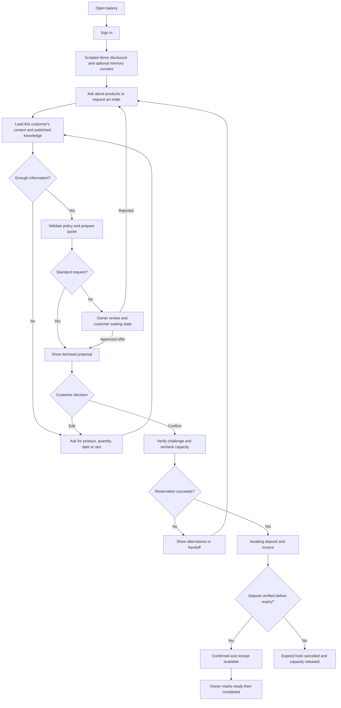
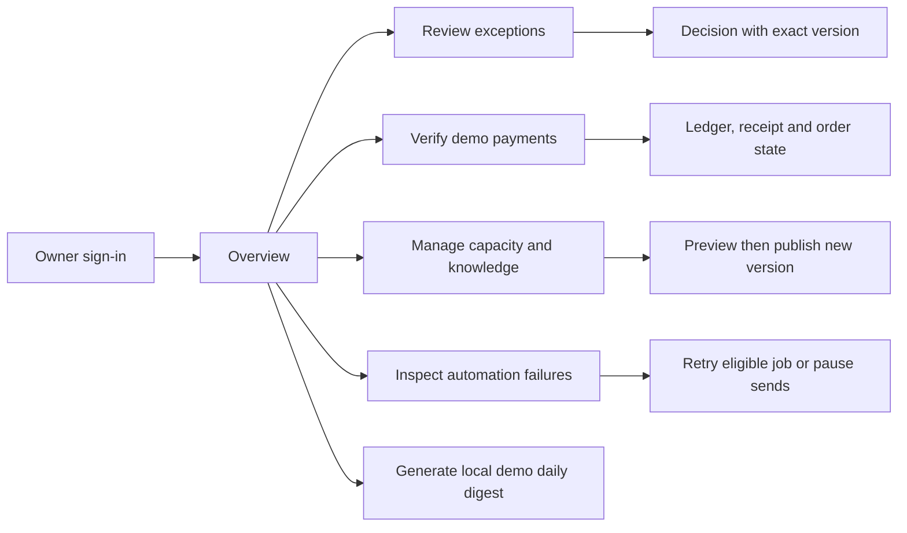
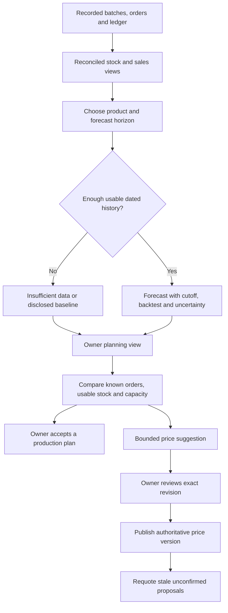

# CustomerBuddy - App Flow

## Expanded local demo E1 (current user authorisation)

The user now explicitly requests a complete Codex local demo without WorkBuddy, using hardcoded/scripted methods. This supersedes earlier specification-only deferrals of expanded features for the local demo. Business profile/catalogue/facts support retail and services; dedicated agent cards, stock/forecasts/pricing, owner/customer assistants, engagement/content/visual templates, risk/ethical controls, calendar/tracking, checkout/members/appointments/sales are implemented with saved scoped records. See [expanded demo contracts and flows](docs/EXPANDED_DEMO.md) and [current checkpoint](IMPLEMENTATION_PLAN.md) for limits and verification status. Future WorkBuddy integration/rebuild remains separate; the existing Phase 6 ZIP is a historical pre-expansion snapshot.

Version 0.6 | 8 October 2026 | Local E1 flows with UX1 navigation and workflow redesign; independent WorkBuddy expansion requirements remain separate.

## UX1 current navigation and workflow (8 October 2026)

- Owner opens Overview → saved metrics, three upcoming orders, stage counts and named priorities → order detail, human reviews or the awaiting-deposit filter.
- One role-aware sidebar groups Workspace, Business, Growth and collapsed Settings & tools. Customer navigation contains Discover, Your buddy, Checkout / book, orders, updates and preferences; legacy `/b/:bakerySlug` URLs retain the correct page label/selection. Page search uses Ctrl/Meta+K, typed page keywords, Tab/Enter and Escape. Native mobile navigation closes on selection and restores focus on Escape.
- Orders → search/status filter → explicit order/Open link → unchanged payment, tracking and document controls. Empty filters offer Clear filters. Customers see only their own records and an empty-history booking entry point.
- Members → searchable directory → Add member modal → real synthetic account saved, form closed and feedback displayed; optional consents remain off. View buddy → `/owner/agents?customer=...` → native interaction drawer → existing authorised transcript/takeover/reply/resume; close clears the parameter and focuses the matching card. No business action occurs merely by opening the drawer.
- Customer chat → clear booking entry or supported scripted quick action. Owner-help and single-item forms, reviews and facts use native disclosures instead of showing every form initially; existing reviews remain discoverable. Order-again/edit explicitly expand the existing single-item form.
- Checkout → basket & schedule → Review exact quote → authoritative itemised price/deposit/window, with focus and automatic mobile scroll to review → explicit review checkbox → Confirm booking. Changing basket/date/window clears the quote and review state. Real confirmation authority and capacity checks are unchanged.

UI-only redesign: APIs, schema, scoped access, approvals, synthetic-payment verification, document jobs and WorkBuddy deferral are retained. Screenshots and gate/browser evidence are in [UX1 review](docs/evidence/ux1/review.md). Actual 200% zoom remains pending by user choice.

Related: [PRD](<C:/Users/Edison Tee/Downloads/SME/PRD.md>), [TRD](<C:/Users/Edison Tee/Downloads/SME/TRD.md>), [Design Brief](<C:/Users/Edison Tee/Downloads/SME/DESIGN_BRIEF.md>).

**Current mode:** Codex implements these flows with hardcoded assistant intent rules/templates and real saved business state. Live AI, MCP and WorkBuddy Automation are Phase 7 work. Chat always shows "Demo assistant — scripted responses"; forms and quick actions provide reliable paths without free-text recognition.

**Independent WorkBuddy target (local E1 routes/flows are mapped in the linked demo runbook):** The following added routes/journeys implement PRD FR-18–FR-27 in the independent WorkBuddy project after its core flow. They are planned requirements, not existing prototype pages. Invoice/payment/approval flows above are reused rather than duplicated. The current documentation request does not start implementation or change the saved Phase 4 gate.

## 1. Entry points and routes

| Route | User and purpose |
| --- | --- |
| `/b/:bakerySlug` | Public bakery introduction, published products, pickup information, Start order |
| `/sign-in` | Customer or owner authentication; roles come from verified identity |
| `/b/:bakerySlug/chat` | Signed-in customer conversation and order proposal |
| `/account/orders` | This customer's order list |
| `/account/orders/:orderCode` | Order details, payment deadline, documents, human handoff |
| `/account/preferences` | Language, optional memory, notification choices, preference correction/deletion |
| `/owner` | Business overview with pending reviews and operational totals |
| `/owner/orders` | Business orders with status/date filters |
| `/owner/orders/:orderCode` | Details, payment verification, fulfilment status and audit |
| `/owner/reviews` | Approval and human-handoff queue |
| `/owner/customers/:customerCode` | Owner-authorised customer detail |
| `/owner/knowledge` | Catalogue/policy publishing |
| `/owner/capacity` | Production capacity by product and pickup date |
| `/owner/automation` | Pause, local reminder/digest configuration, job health, owner-only demo clock/Run due jobs/Generate digest/reset controls |
| `/owner/evidence` | Demonstration mode, timings, failures and tool traces |
| `/owner/agents` (WB planned) | One box per customer-agent context; all active/inactive agents, interaction previews and human-review filters |
| `/owner/agents/:agentCode` (WB planned) | Scoped interaction timeline, open cases, safe outcomes and takeover/resume |
| `/owner/assistant` (WB planned) | Separate owner AI queries with period, sources and links to controlled actions |
| `/owner/stock` (WB planned) | Finished-goods batches, expiry, allocation, waste and audited adjustments |
| `/owner/sales`, `/owner/invoices` (WB planned) | Reconciled sales/cash and existing invoice/document views |
| `/owner/forecast` (WB planned) | Product/horizon selection, data sufficiency, forecasts and proposed production plan |
| `/owner/pricing` (WB planned) | Bounded price suggestions, exact-version review and explicit publication |
| `/owner/campaigns` (WB planned) | Announcements/promotions, eligible audience preview and guarded sending |
| `/owner/content` (WB planned) | Multilingual SEO, email, marketing, social and PR draft review/export |
| `/owner/assets` (WB planned) | Visual generation jobs, rights/provenance, reviewed assets and downloads |
| `/owner/risk` (WB planned) | Private transaction-risk evidence, owner clearance and appeal |
| `/account/support` (WB planned) | Own after-sales cases and service-follow-up choices |

Slugs and display codes locate resources; the server still enforces access. No role switcher is available in a real cloud deployment. A synthetic local demo selector is explicitly labelled and isolated from production authentication.

## 2. Primary customer flow

Customer confirmation is a button or equivalent structured action bound to the visible proposal. The model cannot convert remembered preferences or ambiguous conversation text into a purchase authorisation.

In the prototype, quick actions select supported intents such as View products, Order again, New order, Check order and Ask owner. The structured order form collects product, quantity, exact pickup date and slot and calls the same quote API as scripted chat. Supported example text includes "same as last time", "brownie price", "harga brownies" and "nak owner". Version the complete phrase list during Phase 5; unknown or ambiguous text returns supported choices/handoff instead of an invented answer. Template replies interpolate current service results.

## 3. First visit and consent

1. Customer sees the bakery name, scripted-demo disclosure, published information, and human-contact option. The future rebuild uses truthful managed-AI disclosure.
2. Sign-in maps the verified identity to one customer within the bakery.
3. Ask whether to remember preferences. Default promotional consent is off; operational reminder preference is separate and explicit.
4. Declining optional memory proceeds to chat without a personalisation penalty.
5. Ask one focused question at a time where possible. Collect product, quantity, exact pickup date, and slot before quoting.

Consent controls link to Preferences and explain what can be corrected/deleted. Operational records remain distinct from optional personalisation.

## 4. Repeat order and quote

For "same as last time," show the customer's most recent completed order as a suggestion. If there is no eligible history, ask what they want. A customer's history is never selected from their typed name or a model-supplied customer identifier.

Farah's example: one 24-piece brownie tray, pickup 10 October 2026, 16:00-18:00. Display RM78 total, RM39 deposit, 30-minute quote validity, 24-hour hold after confirmation, and the capacity recheck notice. The quote card offers Confirm, Edit, and Ask owner.

If the quote expires or changes, disable its Confirm control and offer an updated quote. Preserve the user's inputs, but require fresh acceptance. If capacity is unavailable, offer permitted dates/products; do not silently substitute an item.

## 5. Confirmation, deposit, and fulfilment

After Confirm, show a pending state until the transaction resolves. Prevent repeated clicks but also enforce backend idempotency. On success, show an order code, pickup details, verified commercial amounts, deposit deadline, and document status.

A document may be "Preparing" while the order already exists. A failed invoice download never suggests that a committed order must be placed again. Payment instructions are owner-approved fixture content; the MVP does not collect a real payment.

An uploaded payment image produces "Awaiting owner verification." Only owner verification changes the verified paid amount and can confirm the deposit. Late payment after hold expiry goes to owner review rather than automatically reclaiming capacity.

The owner marks a confirmed order Ready and then Completed. The customer sees each state and the remaining balance from the ledger. Cancelled/expired orders keep their historical documents and a clear status label.

## 6. Exceptions and human takeover

1. Unsupported discount, custom cake, refund request, complaint, or unknown policy opens one review case.
2. Customer receives a neutral waiting message and can add relevant details.
3. The assistant stops conflicting automation, including deposit reminders for the active escalated case.
4. Owner sees transcript summary, exact proposed response/action, commercial amounts, policy reason, version and expiry.
5. Approve, Edit, or Reject records an explicit decision. An edit requires a newly bound proposal; an expired approval cannot be applied.
6. An approved commercial offer is shown to the customer for acceptance. It does not automatically mutate a committed order.
7. The owner explicitly resumes the standard assistant after resolving the case. The customer may also continue with the original standard quote where still valid.

Refund execution remains outside the MVP. A refund case can be acknowledged, reviewed and closed with an owner response without recording a fictional transfer.

## 7. Owner operating flow

Overview totals distinguish order value, verified deposits collected, and outstanding amounts. Filters specify the pickup date or reporting period. The review queue prioritises pending cases and payment verification rather than displaying speculative churn scores.

Knowledge publication previews the affected policy/catalogue version. A capacity decrease below held plus committed units is blocked. The owner must resolve affected reservations first.

## 8. Reminder and digest flow

At or after the due time, the bounded worker reconciles expired holds and checks order/payment state, notification preference, human takeover, global pause and previous delivery. A qualifying order receives one in-app deposit reminder. A suppressed reminder records its reason.

If the due time falls outside 09:00-20:00, defer into the next permitted window only if the reservation remains active. Repeated scheduler triggers do not produce repeated reminders.

WorkBuddy's final-phase automation invokes the same guarded processing operation and produces a daily digest from authoritative records. If the desktop scheduler is offline, overdue jobs remain visible; backend booking checks still enforce expiry.

For Codex, a local worker processes persisted jobs. The owner can select Run due jobs or Generate digest without WorkBuddy. The demo clock starts paused at 7 October 2026, 10:00 Malaysia time; advancing to 8 October, 09:00 makes the unpaid-order reminder eligible, and advancing beyond 10:00 expires its hold. Display current demo time; preserve clock/state across restart. Quiet hours, opt-out, payment, takeover and duplicate guards still apply to manual runs. Reset demo requires owner confirmation and restores only local synthetic data/files/clock.

## 9. Loading, error, and empty states

| Condition | User-facing outcome |
| --- | --- |
| Codex prototype mode | Persistent "Demo assistant — scripted responses" label; no WorkBuddy/model-key dependency |
| Text outside supported scripts | Offer quick actions, order form or Ask owner; no fake successful action |
| Agent temporarily unavailable | Preserve submitted message; offer retry or owner handoff; no fabricated reply |
| Write timeout | "Checking order status" with the same action identity; do not encourage another new order |
| Quote outdated | Updated proposal with fresh Confirm control |
| No capacity | Clear alternatives, no implicit reservation |
| Human takeover | Waiting banner; owner contact path; assistant actions paused |
| No previous orders | Friendly catalogue suggestions without invented history |
| Document/job failure | Existing business state remains visible; owner sees retry details |
| Scope denied | Generic not-found/access result without revealing another customer's existence |

## 10. Expanded owner agent board and query flow (WorkBuddy)

1. Owner opens Agents. Load one persisted customer-agent context per customer, including inactive contexts and those with no interactions. Filter Active, Inactive, Needs human review, Paused or Error; paginate without duplicating an agent across conversations.
2. Each box shows customer label, lifecycle, processing state, last interaction/time, open task and outstanding review reason/count. Active describes automation eligibility; Working describes an actual in-flight run. No always-running process or model session is implied.
3. Open a box to see authorised customer/assistant/owner interactions, safe action results and linked review/order/support/risk cases. Inactive history remains readable under retention policy. Owner queries are kept in a separate owner transcript.
4. Select a human-review item to reuse the exact-proposal approval/payment/support flow. Take over pauses conflicting sends/runs; Resume is an explicit owner action. Inactive/pause state cannot be overridden by model text.
5. In Owner assistant, ask "Which invoices are unpaid this week?" or a complex BM/English stock/sales question. Resolve timezone/report period and business scope outside the model. Clarify ambiguity, then fetch read-only summaries and show record links, cutoff and assumptions.
6. A request to change a price, verify payment or publish a campaign opens the corresponding controlled screen/draft. An answer or draft does not execute that decision. Customer chat retains only customer-scoped tools and cannot navigate into owner records through prompt instructions.

## 11. Stock, forecast and controlled pricing flow (WorkBuddy)

Stock receives explicit production/receipt records, lot expiry and owner-entered waste/corrections. Show physical on-hand/allocated/sellable separately from production held/committed/remaining quota. Ready-stock ordering allocates unexpired lots atomically; preorder completion records actual production/stock consumption. A stockout or failed movement reports the current committed order state and recovery path. Never invent a batch from an AI announcement or forecast.

Forecasts show actual vs projected series, data cutoff, history coverage, methodology and known commitments vs incremental demand. Synthetic simulation, stale result and Insufficient data are explicit states. Owner accepts a proposed plan; no automatic purchasing, production record or stock adjustment is created by forecasting. A richer model needs time-separated evaluation against the baseline.

Pricing shows current price, suggested price, stock/expiry/demand reasons, configured floor/ceiling/change limit and validity. Owner reviews/publishes the exact revision. A stale stock/price/policy basis requires refresh. Confirmed orders retain their original snapshots; a displayed old quote must be regenerated and accepted again. Uniform published rules and explicit promotion eligibility remain visible to customers.

## 12. Engagement, content and generated-visual flow (WorkBuddy)

1. Owner records a real batch (for example the proposed Orange Cake fixture), then chooses Batch announcement, Product recommendation, Promotion or After-sales service. Standard deposit reminders remain their existing separate workflow.
2. Create a draft from approved product facts/available stock and selected BM/English language. SEO content includes title/meta description; email, social post and PR variants preserve the same facts/terms. Generate a visual only through supported Tencent server jobs; show Queued, Generating, Failed or Draft available with cost/capability limits.
3. Preview copy, image, provenance, offer validity and audience eligibility. Real product appearance/ingredients/certifications cannot be invented. Changes create a new revision and invalidate prior approval; generated illustrative artwork is labelled.
4. Owner approves the exact content/assets/offer and audience policy. Export approved social/PR/email drafts, or schedule in-app delivery. External delivery exists only when the restricted connector, recipient identity and acknowledgement path are verified; an export is not a sent message.
5. Before delivery, recheck marketing/personalisation/channel consent, cross-channel cap (initially one promotion in seven days), quiet hours, takeover/global pause, content/offer/batch validity and deduplication. Record Delivered, Suppressed with reason, Failed or Delivery uncertain accurately.
6. Customer sees a concise announcement/recommendation, why it was suggested, relevant terms and Stop promotions. Opening an offer prepares a current quote; no recommendation authorises purchase. Opt-out immediately suppresses queued promotions and removes optional derived targeting data.
7. After a completed order, one permitted service check-in can open the customer's scoped support case. Complaints, safety questions and refund requests hand off to the owner. Cross-sell content follows marketing consent rather than borrowing service-follow-up permission.

## 13. Transaction-risk and ethical review flow (WorkBuddy)

1. Operational rules flag duplicate references, excessive attempts, mismatched amounts or inconsistent submitted proof. Commerce independently rejects invalid duplicates; an optional anomaly score is advisory.
2. A private owner case shows reason codes, source records, rule/model version, uncertainty and any explicit review deadline. Customer copy says "Needs verification" without labelling the person fraudulent.
3. Owner inspects evidence and clears or escalates the case with a reason. Payment verification remains a separate explicit action. A risk flag alone cannot create a receipt, execute refund, erase a verified payment or ban a customer.
4. A benign unusual transaction can be cleared; provide a customer human-contact/appeal path. Expired holds still follow normal expiry/capacity rules, never an invisible risk lock.
5. Preferences separates memory, personalisation, marketing by channel, operational reminders and service follow-up. Declining optional targeting still allows ordering. No covert cross-platform tracking is introduced. Owner content review rejects fabricated urgency, guilt/addictive prompts, sensitive-trait pricing and misleading AI imagery.

Additional state acceptance: empty agent history, inactive context with past interactions, multiple review reasons, stale forecast, insufficient history, expired lot, conflicting stock allocation, out-of-bound/stale price proposal, withdrawn consent after scheduling, revised unapproved draft, unavailable visual service, uncertain external delivery and owner-cleared risk case. These must be reviewable without fabricated model/connector success.

## 14. Phase mapping

Codex Phases 1-5 build usable local flows: route shells, scoped saved data, business transitions, forms/UI, generated documents, local jobs and hardcoded assistant scripts. Phase 6 accepts a runnable prototype and captures its portable reference pack, screenshots and expected behaviour. Phase 6 can complete with Phase 7 still Not started. WorkBuddy later recreates every flow in a fresh Phase 7 project, adds actual managed AI/owner integration and deploys that new implementation. Each rebuild subphase has its own end gate; prototype passes are reference expectations only.

Expanded journeys are included as specification/contracts/scenarios in the Phase 6 reference pack, clearly labelled unbuilt where no prototype screen exists. WorkBuddy 7A defines their schema, 7B their deterministic services, 7C the UI/jobs/documents and 7D the scoped AI/retrieval/forecast/content/risk integrations. 7E verifies the expanded release and records unfinished/unsupported optional model or channel upgrades. See the TRD candidate register for repository choices; no third-party framework replaces WorkBuddy orchestration.

## Phase 4 implementation checkpoint

Sign-in, profile/consent/preferences, saved chat, explicit order form, quote/edit/confirmation, order history/detail and customer approved-offer review now persist through the API. The owner UI connects overview/orders/reviews/customers/knowledge/capacity/automation/evidence; synthetic payment verification and human takeover/reply/resume are active. Customer-to-owner and owner-to-customer private routes show role prompts. Message saving is active; scripted replies/files/jobs remain Phase 5.

Browser B01–B08 passed. Responsive BM/EN, labels, skip link/menu/focus/status and core contrast were inspected; 200% zoom remains pending at user request and 360px runtime requests clamp to 400px. Phase 4 is built, not yet Complete. See IMPLEMENTATION_PLAN.md and docs/evidence/phase4-review.md.

## Phase 5 implementation checkpoint — 7 October 2026

Phase 5 is complete after its focused gate and affected repairs. The prototype now runs persisted, customer-scoped scripted responses with BM/English templates, private snapshot PDFs, bounded local jobs, in-app deposit reminders, saved owner digests and owner clock/pause/reset controls. This supersedes earlier Phase 4 notes that deferred these mechanics. Phase 4's 200% zoom remains pending by user choice. Phase 6 acceptance/reference packaging and all Phase 7 WorkBuddy/FR-18–FR-27 expansion work remain unimplemented. Evidence: [Phase 5 review](docs/evidence/phase5-review.md); [supported inputs](docs/SCRIPTED_INPUTS.md).

Customer sends a saved message → scoped script dispatch → published facts/status or explicit form/preferences controls. Unknown/authority-changing text offers supported choices. Owner help creates a real review and pauses dispatch; messages continue saving until owner resumes. Language templates follow the current profile language. Scripts never confirm a quote or verify payments.

Confirm an exact form quote → jobs generate summary/invoice → owner verifies synthetic deposit → receipt job → customer downloads through authenticated scope. Owner Automation offers paused/resumed/advanced demo time, Run due jobs, Generate digest, reminder pause and typed reset. Eligible reminders defer outside permitted hours and recheck current conditions before one durable in-app delivery. Historical notices link to current order balance. Reset UI requires exact confirmation; Phase5 testing reset only the disposable database.

## Phase 6 completed local-reference milestone

Phase6 is Complete: usable scripted local prototype,111 integration/acceptance checks, quality/build, actual restart and screenshot/PDF inspection passed after affected repairs. Portable behaviour/design/schema/fixture/contracts/scenarios/evidence pack is handoff/workbuddy-reference, with no app source/migrations/builds/secrets. Health reports phase6; saved messages await scripted dispatch; expired quotes require a fresh quote. No commercial authority/schema change in this phase. Phase4 actual200%zoom remains pending by user choice; exact360px is tool-clamped400. Manual savings baseline is unmeasured. Tencent WorkBuddy independently generates/tests/deploys its new project in7A–7E; all FR18–27/cloud/managedAI expansion work remains Not started. Earlier checkpoints are historical records superseded by this current milestone.

## S1 — Owner setup and customer shopping (8 October 2026)

Landing → Set up my business → synthetic name/address/industry/fulfilment form → own owner session → Business & collection → Policies → Availability → Preview & finish. Each form persists independently; readiness is derived from published facts, available items and eligible future capacity. Customer: public store → search/type filter → product details → Add to bag → business-specific synthetic sign-in → saved basket → date/window → exact member-priced quote → explicit confirmation → saved order/tracking. Members: explicit join/leave; separate newsletter toggle; My updates inbox. Owner preview stays read-only until customer sign-in.

