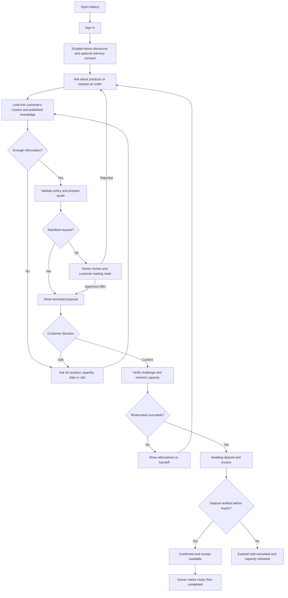
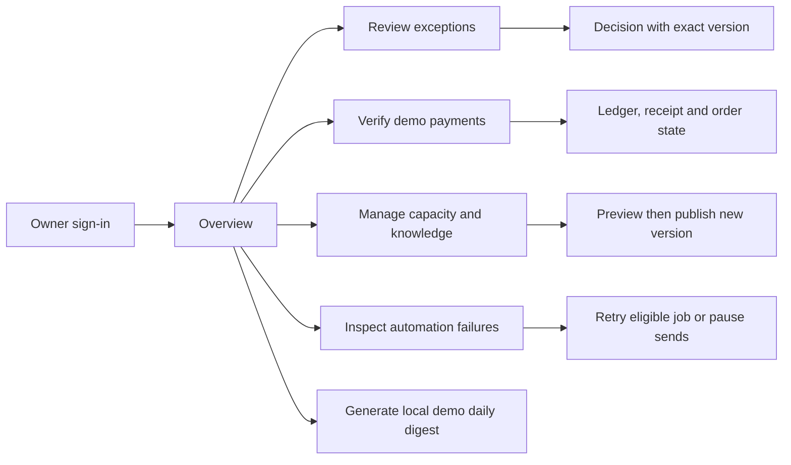

# CustomerBuddy - App Flow

Version 0.3 | 7 October 2026 | Usable scripted prototype flows and future independent WorkBuddy rebuild.

Related: [PRD](<C:/Users/Edison Tee/Downloads/SME/PRD.md>), [TRD](<C:/Users/Edison Tee/Downloads/SME/TRD.md>), [Design Brief](<C:/Users/Edison Tee/Downloads/SME/DESIGN_BRIEF.md>).

**Current mode:** Codex implements these flows with hardcoded assistant intent rules/templates and real saved business state. Live AI, MCP and WorkBuddy Automation are Phase 7 work. Chat always shows "Demo assistant — scripted responses"; forms and quick actions provide reliable paths without free-text recognition.

## 1. Entry points and routes

| Route | User and purpose |
| --- | --- |
| `/b/:bakerySlug` | Public bakery introduction, published products, pickup information, Start order |
| `/sign-in` | Customer or owner authentication; roles come from verified identity |
| `/b/:bakerySlug/chat` | Signed-in customer conversation and order proposal |
| `/account/orders` | This customer's order list |
| `/account/orders/:orderCode` | Order details, payment deadline, documents, human handoff |
| `/account/preferences` | Language, optional memory, notification choices, preference correction/deletion |
| `/owner` | Business overview with pending reviews and operational totals |
| `/owner/orders` | Business orders with status/date filters |
| `/owner/orders/:orderCode` | Details, payment verification, fulfilment status and audit |
| `/owner/reviews` | Approval and human-handoff queue |
| `/owner/customers/:customerCode` | Owner-authorised customer detail |
| `/owner/knowledge` | Catalogue/policy publishing |
| `/owner/capacity` | Production capacity by product and pickup date |
| `/owner/automation` | Pause, local reminder/digest configuration, job health, owner-only demo clock/Run due jobs/Generate digest/reset controls |
| `/owner/evidence` | Demonstration mode, timings, failures and tool traces |

Slugs and display codes locate resources; the server still enforces access. No role switcher is available in a real cloud deployment. A synthetic local demo selector is explicitly labelled and isolated from production authentication.

## 2. Primary customer flow

Customer confirmation is a button or equivalent structured action bound to the visible proposal. The model cannot convert remembered preferences or ambiguous conversation text into a purchase authorisation.

In the prototype, quick actions select supported intents such as View products, Order again, New order, Check order and Ask owner. The structured order form collects product, quantity, exact pickup date and slot and calls the same quote API as scripted chat. Supported example text includes "same as last time", "brownie price", "harga brownies" and "nak owner". Version the complete phrase list during Phase 5; unknown or ambiguous text returns supported choices/handoff instead of an invented answer. Template replies interpolate current service results.

## 3. First visit and consent

1. Customer sees the bakery name, scripted-demo disclosure, published information, and human-contact option. The future rebuild uses truthful managed-AI disclosure.
2. Sign-in maps the verified identity to one customer within the bakery.
3. Ask whether to remember preferences. Default promotional consent is off; operational reminder preference is separate and explicit.
4. Declining optional memory proceeds to chat without a personalisation penalty.
5. Ask one focused question at a time where possible. Collect product, quantity, exact pickup date, and slot before quoting.

Consent controls link to Preferences and explain what can be corrected/deleted. Operational records remain distinct from optional personalisation.

## 4. Repeat order and quote

For "same as last time," show the customer's most recent completed order as a suggestion. If there is no eligible history, ask what they want. A customer's history is never selected from their typed name or a model-supplied customer identifier.

Farah's example: one 24-piece brownie tray, pickup 10 October 2026, 16:00-18:00. Display RM78 total, RM39 deposit, 30-minute quote validity, 24-hour hold after confirmation, and the capacity recheck notice. The quote card offers Confirm, Edit, and Ask owner.

If the quote expires or changes, disable its Confirm control and offer an updated quote. Preserve the user's inputs, but require fresh acceptance. If capacity is unavailable, offer permitted dates/products; do not silently substitute an item.

## 5. Confirmation, deposit, and fulfilment

After Confirm, show a pending state until the transaction resolves. Prevent repeated clicks but also enforce backend idempotency. On success, show an order code, pickup details, verified commercial amounts, deposit deadline, and document status.

A document may be "Preparing" while the order already exists. A failed invoice download never suggests that a committed order must be placed again. Payment instructions are owner-approved fixture content; the MVP does not collect a real payment.

An uploaded payment image produces "Awaiting owner verification." Only owner verification changes the verified paid amount and can confirm the deposit. Late payment after hold expiry goes to owner review rather than automatically reclaiming capacity.

The owner marks a confirmed order Ready and then Completed. The customer sees each state and the remaining balance from the ledger. Cancelled/expired orders keep their historical documents and a clear status label.

## 6. Exceptions and human takeover

1. Unsupported discount, custom cake, refund request, complaint, or unknown policy opens one review case.
2. Customer receives a neutral waiting message and can add relevant details.
3. The assistant stops conflicting automation, including deposit reminders for the active escalated case.
4. Owner sees transcript summary, exact proposed response/action, commercial amounts, policy reason, version and expiry.
5. Approve, Edit, or Reject records an explicit decision. An edit requires a newly bound proposal; an expired approval cannot be applied.
6. An approved commercial offer is shown to the customer for acceptance. It does not automatically mutate a committed order.
7. The owner explicitly resumes the standard assistant after resolving the case. The customer may also continue with the original standard quote where still valid.

Refund execution remains outside the MVP. A refund case can be acknowledged, reviewed and closed with an owner response without recording a fictional transfer.

## 7. Owner operating flow

Overview totals distinguish order value, verified deposits collected, and outstanding amounts. Filters specify the pickup date or reporting period. The review queue prioritises pending cases and payment verification rather than displaying speculative churn scores.

Knowledge publication previews the affected policy/catalogue version. A capacity decrease below held plus committed units is blocked. The owner must resolve affected reservations first.

## 8. Reminder and digest flow

At or after the due time, the bounded worker reconciles expired holds and checks order/payment state, notification preference, human takeover, global pause and previous delivery. A qualifying order receives one in-app deposit reminder. A suppressed reminder records its reason.

If the due time falls outside 09:00-20:00, defer into the next permitted window only if the reservation remains active. Repeated scheduler triggers do not produce repeated reminders.

WorkBuddy's final-phase automation invokes the same guarded processing operation and produces a daily digest from authoritative records. If the desktop scheduler is offline, overdue jobs remain visible; backend booking checks still enforce expiry.

For Codex, a local worker processes persisted jobs. The owner can select Run due jobs or Generate digest without WorkBuddy. The demo clock starts paused at 7 October 2026, 10:00 Malaysia time; advancing to 8 October, 09:00 makes the unpaid-order reminder eligible, and advancing beyond 10:00 expires its hold. Display current demo time; preserve clock/state across restart. Quiet hours, opt-out, payment, takeover and duplicate guards still apply to manual runs. Reset demo requires owner confirmation and restores only local synthetic data/files/clock.

## 9. Loading, error, and empty states

| Condition | User-facing outcome |
| --- | --- |
| Codex prototype mode | Persistent "Demo assistant — scripted responses" label; no WorkBuddy/model-key dependency |
| Text outside supported scripts | Offer quick actions, order form or Ask owner; no fake successful action |
| Agent temporarily unavailable | Preserve submitted message; offer retry or owner handoff; no fabricated reply |
| Write timeout | "Checking order status" with the same action identity; do not encourage another new order |
| Quote outdated | Updated proposal with fresh Confirm control |
| No capacity | Clear alternatives, no implicit reservation |
| Human takeover | Waiting banner; owner contact path; assistant actions paused |
| No previous orders | Friendly catalogue suggestions without invented history |
| Document/job failure | Existing business state remains visible; owner sees retry details |
| Scope denied | Generic not-found/access result without revealing another customer's existence |

## 10. Phase mapping

Codex Phases 1-5 build usable local flows: route shells, scoped saved data, business transitions, forms/UI, generated documents, local jobs and hardcoded assistant scripts. Phase 6 accepts a runnable prototype and captures its portable reference pack, screenshots and expected behaviour. Phase 6 can complete with Phase 7 still Not started. WorkBuddy later recreates every flow in a fresh Phase 7 project, adds actual managed AI/owner integration and deploys that new implementation. Each rebuild subphase has its own end gate; prototype passes are reference expectations only.

## Phase 4 implementation checkpoint

Sign-in, profile/consent/preferences, saved chat, explicit order form, quote/edit/confirmation, order history/detail and customer approved-offer review now persist through the API. The owner UI connects overview/orders/reviews/customers/knowledge/capacity/automation/evidence; synthetic payment verification and human takeover/reply/resume are active. Customer-to-owner and owner-to-customer private routes show role prompts. Message saving is active; scripted replies/files/jobs remain Phase 5.

Browser B01–B08 passed. Responsive BM/EN, labels, skip link/menu/focus/status and core contrast were inspected; 200% zoom remains pending at user request and 360px runtime requests clamp to 400px. Phase 4 is built, not yet Complete. See IMPLEMENTATION_PLAN.md and docs/evidence/phase4-review.md.
