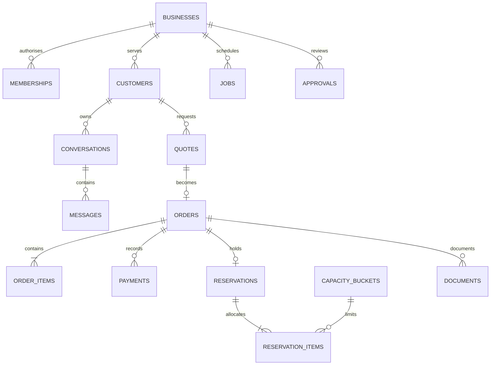

# BizBuddy - Backend / Database Schema

## Expanded local demo E1 (current user authorisation)

The user now explicitly requests a complete Codex local demo without WorkBuddy, using hardcoded/scripted methods. This supersedes earlier specification-only deferrals of expanded features for the local demo. Business profile/catalogue/facts support retail and services; dedicated agent cards, stock/forecasts/pricing, owner/customer assistants, engagement/content/visual templates, risk/ethical controls, calendar/tracking, checkout/members/appointments/sales are implemented with saved scoped records. See [expanded demo contracts and flows](docs/EXPANDED_DEMO.md) and [current checkpoint](IMPLEMENTATION_PLAN.md) for limits and verification status. Future WorkBuddy integration/rebuild remains separate; the existing Phase 6 ZIP is a historical pre-expansion snapshot.

Version 0.5 | 7 October 2026 | Migrations001–003 unchanged; expanded WorkBuddy schema specified only; Phase 4 zoom gate pending.

"Background Schema" is interpreted here as the backend/database schema. Visual background tokens are covered in the Design Brief.

Related: [TRD](<C:/Users/Edison Tee/Downloads/SME/TRD.md>), [PRD](<C:/Users/Edison Tee/Downloads/SME/PRD.md>).

## 1. Storage choices and conventions

Codex authors prototype schema definitions/migrations for local PostgreSQL in Phase 2. This document, synthetic fixture data and observed behaviours become references. WorkBuddy independently authors new migrations in its fresh Phase 7 project and applies them to a separate CloudBase database. Preserve data meaning, constraints and transaction behaviour; do not assume the prototype SQL is the final implementation or that its test results validate the rebuild.

**Prototype persistence:** Hardcode only assistant matching/wording and synthetic seed inputs. Customer identities, consent, memory, catalogue versions, quotes, orders, payments, approvals, capacity, messages, jobs, documents and digest inputs are real database records and survive restart. Owner edits affect subsequent service results. No WorkBuddy/LLM/MCP connection is required to use this schema locally; integration grants/transport are future specifications, not Codex connector tasks.

**Expansion status:** Section 11 specifies new WorkBuddy records for PRD FR-18–FR-27. These are not present in applied prototype migrations and no SQL/schema code is changed by this documentation update. WorkBuddy authors new versioned migrations in its separate project, preserving the current order/payment/invoice authority. Do not edit applied prototype migrations or claim the new tables have passed RLS/integration checks.

- Application IDs: UUID, generated by the application or a verified database UUID function. Display codes are separate strings.
- Every business-owned record includes `business_id`; customer-owned records also include `customer_id`.
- Provider identity is `(auth_provider, provider_subject TEXT)`. Do not assume that a provider subject is the application's customer UUID.
- Money: non-negative integer `BIGINT` sen. Convert safely at API boundaries; impose a small MVP order-value limit rather than silently losing JavaScript integer precision.
- Dates: `DATE` for the bakery's pickup date; `TIMESTAMPTZ` for events/deadlines; slot times interpreted in `Asia/Kuala_Lumpur`.
- Mutable objects have `version INTEGER`, `created_at`, and `updated_at`. Approved catalogue/policy snapshots, quotes, ledger events and audit events are immutable except explicit lifecycle metadata.
- Use foreign keys and check constraints. Protect business/customer consistency with composite keys, not only application filtering.
- Keep optional preferences distinct from operational transaction records. Do not persist sensitive health/allergy details in the MVP.

## 2. Main relationships

The diagram shows key operational relationships; the complete table inventory follows.

## 3. Identity, consent, and knowledge tables

| Table | Important columns | Constraints and lifecycle |
| --- | --- | --- |
| `businesses` | `id`, `slug`, `name`, `timezone`, `active_knowledge_version_id`, `automation_paused`, `version` | Unique slug; one active published version belonging to this business |
| `memberships` | `business_id`, `auth_provider`, `provider_subject`, `role`, `active` | Unique identity per business; MVP owner role only; provider subject is text |
| `customers` | `id`, `business_id`, provider identity, `display_code`, `display_name`, `preferred_language`, `status`, `version` | Unique `(business_id,id)`, display code, and provider identity; no identity matching by display name |
| `consent_events` | `id`, scope, `purpose`, `granted`, `captured_at`, `source`, `notice_version` | Append-only; purpose is preference memory, operational reminders, or marketing; latest event determines current choice |
| `customer_preferences` | `id`, scope, `key`, `value_json`, `source_message_id`, `consent_event_id`, timestamps | Unique live `(business_id,customer_id,key)`; write requires valid memory consent; correction/delete auditable |
| `knowledge_versions` | `id`, `business_id`, `version_number`, `state`, `policy_json`, `published_at`, `created_by` | Unique version number per business; draft/published/retired; published policy content immutable |
| `knowledge_entries` | `id`, `business_id`, `knowledge_version_id`, `fact_key`, `category`, `content_bm`, `content_en` | Unique fact key per version; category FAQ/pickup/payment/ingredients; agent trace references entry/version |
| `products` | `id`, `business_id`, `sku`, `active` | Stable product identity across catalogue versions; unique business/SKU; existing history is retained when a product is deactivated |
| `catalogue_items` | `id`, `business_id`, `knowledge_version_id`, `product_id`, `label`, `description`, `unit_price_sen`, `units_description`, `available` | Unique product per published version; scoped product foreign key; price >= 0; prior versions retained for quote/order references |
| `pickup_slots` | `id`, `business_id`, `code`, `start_local`, `end_local`, `active` | Unique code; start < end; seed 12:00-14:00 and 16:00-18:00 |

`policy_json` has a versioned Zod schema: lead time, deposit basis points, quote lifetime, hold lifetime, reminder delay, quiet hours, and allowed exception types. Publishing rejects missing/invalid values. It is not an unvalidated bag of model-generated settings.

## 4. Conversation and agent-run tables

| Table | Important columns | Constraints and lifecycle |
| --- | --- | --- |
| `conversations` | `id`, scope, `state`, `human_takeover`, `language`, timestamps | State active/waiting_owner/closed; scope cannot change after creation |
| `messages` | `id`, scope, `conversation_id`, `role`, `content`, `structured_payload`, `source_action_key`, `created_at` | Role customer/assistant/owner/system; immutable content; unique source action prevents duplicate reminder/reply writes |
| `agent_runs` | `id`, scope, `conversation_id`, `input_message_id`, `adapter`, `matched_intent`, `script_version`, `state`, `tool_calls`, `started_at`, `finished_at`, nullable `usage_json`, `error_code` | Prototype adapter scripted; future rebuild cloudbase; unique run per input message; one in-flight run per conversation or ordered queue; model usage null in scripted mode |

`structured_payload` contains validated cards and business object references, not trusted identity or arbitrary HTML. Store tool names, approved facts and outcomes; do not store private model reasoning.

For scripted runs, `tool_calls` records actual domain-service calls and outcomes, not fabricated model traces. Store unknown-input/fallback intent explicitly. `script_version` identifies the rule/template set; it does not grant business authority. WorkBuddy's new schema may add model/provider/usage fields when actual managed AI is implemented.

Optional memory deletion must remove active preferences and derived optional summaries. Conversation/financial retention is a separate configured policy; do not promise deletion of legally retained operational records without an assessment.

## 5. Quote, order, payment, and capacity tables

| Table | Important columns | Constraints and lifecycle |
| --- | --- | --- |
| `quotes` | `id`, scope, `knowledge_version_id`, `items_json`, `pickup_date`, `pickup_slot_id`, `total_sen`, `deposit_sen`, `proposal_hash`, `approval_id`, `expires_at`, `state` | Immutable priced snapshot; state active/accepted/expired/superseded; deposit <= total; items schema requires positive quantities and valid SKU/version |
| `confirmation_challenges` | `id`, scope, `quote_id`, `proposal_hash`, `token_hash`, `expires_at`, `consumed_at` | Store hash only; short-lived and single-use; bound to signed-in customer and exact visible proposal |
| `orders` | `id`, scope, `display_code`, `quote_id`, `knowledge_version_id`, `pickup_date`, `pickup_slot_id`, `total_sen`, `deposit_required_sen`, `state`, `exception_paused`, `version`, timestamps | Unique accepted quote -> at most one order; total/required deposit snapshot immutable; permitted states defined below |
| `order_items` | `id`, scope, `order_id`, `product_id`, `catalogue_item_id`, `sku_snapshot`, `label_snapshot`, `quantity`, `unit_price_sen`, `line_total_sen` | Scoped product/catalogue foreign keys; quantity > 0; line total = quantity * unit price; totals reconcile during the atomic order operation |
| `capacity_buckets` | `id`, `business_id`, `product_id`, `pickup_date`, `max_units`, `held_units`, `committed_units`, `version` | Unique business/product/date; scoped product foreign key; all counts >= 0; held + committed <= max; product stable across catalogue versions |
| `reservations` | `id`, scope, `order_id`, `state`, `expires_at`, `released_at`, `committed_at` | Unique order; state held/committed/released; terminal release is idempotent |
| `reservation_items` | `reservation_id`, scope, `capacity_bucket_id`, `quantity` | Scoped reservation/bucket foreign keys; unique reservation/bucket; positive quantity; allocation matches order product/date quantity |
| `payments` | `id`, scope, `order_id`, `amount_sen`, `reference`, `verified_by`, `verified_at`, `state`, `is_synthetic`, `correction_reason` | Positive amount; unique business/payment reference; verified/voided; owner authority required; corrections audited rather than silent deletion |

Quote line items use a validated immutable JSON snapshot to keep the MVP compact; confirmed order items are relational for reporting and allocation. Database procedures/services reconcile snapshot totals and referenced entities. Never trust a model-provided total or JSON customer ID.

Verified paid amount and remaining balance derive from valid payment records. Do not let clients write cached paid totals directly. For P0, demonstrate an exact 50% deposit and optional remaining-balance verification; overpayment and late payment require review rather than silent auto-adjustment.

Committed capacity remains booked after fulfilment: completed orders still consumed that day's production. A reviewed cancellation releases its allocation exactly once. It does not execute a refund or erase the payment ledger.

## 6. Approval, jobs, files, and audit tables

| Table | Important columns | Constraints and lifecycle |
| --- | --- | --- |
| `approvals` | `id`, scope, optional `order_id`, `conversation_id`, `kind`, `proposal_json`, `proposal_hash`, `policy_version_id`, `state`, `expires_at`, `decided_by`, `decided_at`, `decision_note` | pending/approved/rejected/expired/superseded; immutable proposal; decision requires owner and exact hash/version |
| `jobs` | `id`, `business_id`, optional customer/order scope, `kind`, `payload_json`, `action_key`, `state`, `due_at`, `attempts`, `lease_owner`, `lease_until`, `last_error` | Unique business/action key; queued/running/completed/suppressed/failed; bounded attempts and lease recovery |
| `outbox_events` | `id`, scope, `kind`, `entity_id`, `action_key`, `payload_json`, `state`, timestamps | Unique action key; inserted in business transaction; only worker changes delivery state |
| `documents` | `id`, scope, nullable `order_id`/`quote_id`/`payment_id`, `kind`, `revision`, `state`, `storage_key`, `content_hash`, `supersedes_id` | Quote requires scoped quote; summary/invoice require order; receipt requires order and verified payment; private storage |
| `idempotency_records` | `id`, `business_id`, `actor_subject`, `operation`, `key`, `request_hash`, `state`, `result_json`, timestamps | Unique actor/operation/key within business; payload mismatch rejected; successful replay returns recorded result |
| `audit_events` | `id`, scope, `actor_type`, `actor_subject`, `action`, `entity_type/id`, `entity_version`, `correlation_id`, `safe_details_json`, `occurred_at` | Append-only; no credentials or private reasoning; customer cannot read raw business-wide audit |

Approval authorises the exact offered exception, not a generic future discount. An approved offer becomes a new quote for customer acceptance. Existing paid/committed financial records are not rewritten by an agent. A complex amendment can remain a human case outside automated P0 handling.

Avoid polymorphic references as the only integrity control. Critical relations use explicit foreign keys; job payloads reference existing scoped entities validated by the worker.

Use document-kind checks and partial unique indexes for quote/kind/revision, order/kind/revision, and payment/receipt/revision as applicable. Quote files can exist before any order is created. Receipt eligibility is checked transactionally against the payment ledger; nullable references must not allow unbound documents.

## 7. Composite integrity and indexes

For each customer-owned parent, provide `UNIQUE (business_id, customer_id, id)`. Children reference that complete tuple where applicable. Orders also reference the scoped customer and quote. This prevents a record from attaching a customer from another business even if a UUID was guessed.

Planned indexes:

- Unique keys listed in each table, plus foreign-key lookup indexes not already covered by a leading composite index.
- Orders `(business_id, customer_id, created_at DESC)` and `(business_id, pickup_date, state)`.
- Messages `(business_id, customer_id, conversation_id, created_at, id)` for stable pagination.
- Pending approvals `(business_id, expires_at)` partial index where state = pending.
- Due jobs `(due_at, id)` partial index where state = queued; expired running leases also indexed.
- Held reservations `(business_id, expires_at)` partial index where state = held.
- Payments `(business_id, order_id, verified_at)` and audit `(business_id, occurred_at DESC)`.

A supporting composite index can cover a foreign key; do not create redundant indexes for every column. Tune against actual phase-end queries rather than adding a vector database or speculative analytics indexes.

## 8. Authorisation and RLS

Use separate migration/admin, application, integration and worker roles. Browser clients do not receive database service credentials or unrestricted write access. Keep most operations behind the API for the MVP.

The server verifies the user and sets transaction-local identity/scope before using a restricted database role. Local and cloud identity adapters map into the same application scope. Missing context denies access. Connection-pool context must be transaction-local so one customer's identity cannot survive into another request.

| Data family | Customer | Owner | WorkBuddy integration |
| --- | --- | --- | --- |
| Published catalogue/policies | Read published business records | Manage versions | Read approved facts |
| Customer preferences/consents | Read/change own allowed data | Read operationally necessary data | No raw preference export |
| Conversations/orders | Read own; use controlled API mutations | Business-scoped read and permitted operations | Restricted aggregate views/case summaries |
| Approval decisions/payments | No write | Explicit reviewed action | No approval or payment-verification authority |
| Capacity counters | Read available output only | Configure through invariant checks | Read summary only |
| Jobs/outbox | No direct writes | Inspect/retry/pause eligible work | Bounded enqueue/process operation only |
| Documents | Scoped download | Business-scoped download | Metadata or approved aggregate output only |
| Audit | Own safe status history only | Business-scoped audit | Redacted summary only |

Enable and, where compatible with the verified runtime roles, force RLS on sensitive tables. The runtime must not be the table owner, superuser, or a `BYPASSRLS` role. CloudBase direct-client policies use the platform's verified identity function; server-side policies use trusted transaction scope. Test the actual access path because a privileged connection can bypass a seemingly correct policy.

Integration queries should use purpose-built views/functions with checked business scope and restricted grants. Any security-definer function must use a fixed safe search path, check authority, and expose no arbitrary SQL.

## 9. Capacity and payment transactions

### Confirm a quote

1. Authenticate customer; validate idempotency key/request hash.
2. Validate single-use confirmation challenge, quote hash, scope, expiry, policy and lead time.
3. Acquire a transaction-scoped business/pickup-date advisory lock; all capacity-changing operations follow this same ordering. Lock affected capacity rows in stable order.
4. Reconcile expired held orders for that date and release their held quantities exactly once.
5. Check available units. On failure roll back without partial order/reservation records.
6. Insert order, relational items, hold and allocation rows; increment held counts.
7. Consume challenge, mark quote accepted, and insert invoice/reminder outbox entries, audit and idempotency result.
8. Commit; only then report reserved/awaiting-deposit.

For the small MVP, date-level advisory locking simplifies payment/expiry/booking contention. Derive lock keys from a stable business/date mapping; do not rely on a process-local JavaScript mutex. Any operation spanning dates acquires date locks in sorted order.

### Verify deposit

Acquire the same date-level lock, then lock order/reservation and capacity rows. Verify owner authority, payment reference, amount and hold state. Record payment without duplication. If the deposit threshold is reached while the hold is valid, move held units to committed units and confirm the order. Queue one receipt. If expired, store the verified payment as requiring review and do not auto-confirm an unavailable slot.

### Expire or cancel

Acquire the same locks. Compare state and actual deadline. Release held or approved cancelled committed allocation once; update order/reservation together and suppress obsolete reminder jobs. A restarted worker repeats this safely.

## 10. Seeds, migrations, and phase-end checks

Seed one bakery, one owner, ten synthetic customers, two catalogue items, both pickup slots, consent/history fixtures for Farah and Jason, and capacity dates around 10 October 2026. Fixture clock: 7 October 2026, 10:00 Malaysia time. Use fake payment references and `is_synthetic=true`.

Persist a local-demo-only clock configuration (base demo time, real-time anchor and paused/running mode) in a singleton demo settings record or equivalently durable local configuration. All business deadlines use the clock service; worker leases use real wall time. Clock advance never directly edits quote/order/payment records to force success: normal guarded services reconcile due work/expiry. Reset stops the worker, restores only local synthetic records/files and initial clock, then resumes; expose it only through an explicitly confirmed local owner action. Do not seed permanent fake digest totals; calculate digest from current orders/payments/reviews/jobs.

Codex Phase 2 verifies prototype migrations/identity/RLS; Phase 3 verifies commerce/concurrency; Phase 5 verifies jobs/documents; Phase 6 runs one reference acceptance batch. WorkBuddy separately creates and tests its own schema in Phase 7A, commerce in 7B, UI/jobs/documents in 7C, agent tools in 7D and cloud release in 7E. These gates run after each phase/subphase is built, not after every edit.

Do not execute these checks after each migration edit. Complete the phase build work first, then run its gate. No production migration or real customer data is involved. Local synthetic migration/seed and gate results are recorded in Implementation Plan.

Before any destructive real-data migration, export/snapshot and review the affected records. Deleting an optional preference must not cascade-delete orders, payments, or their audit history.

## 11. Expanded WorkBuddy data model (planned, not migrated)

All new business-owned rows carry `business_id`; customer-owned rows also carry `customer_id`. Composite scoped foreign keys, immutable snapshots, explicit lifecycle transitions, least-privilege RLS and idempotency apply as above. Existing `orders`, `payments`, `documents`, `approvals`, `jobs` and `audit_events` remain authoritative; no second sales/invoice/payment ledger is introduced. Optional model outputs never grant authority.

### 11.1 Agent contexts and owner conversations

| Planned table/view | Important columns | Integrity and meaning |
| --- | --- | --- |
| `customer_agents` | `id`, scope, `lifecycle`, `version`, `activated_at`, `deactivated_at`, timestamps | Unique `(business_id,customer_id)`; lifecycle active/inactive/archived with explicit audited transitions. One logical context across conversations, not one process or provider account |
| `owner_agent_board` (projection) | agent/customer labels, lifecycle, processing state, latest interaction/time, open task, review reasons/counts | Owner-only business view joins current conversations/runs and unresolved customer cases; one row per agent, including no-message/inactive contexts. No fake cached totals; distinguish Idle/Working/Waiting for owner/Paused/Error |
| `owner_conversations` | `id`, `business_id`, `owner_subject`, `state`, timestamps | Owner membership required; never attaches to a customer conversation or appears in customer messages |
| `owner_messages`, `owner_query_runs` | owner conversation FK, role/content, structured answer, period/filters, source IDs, model/version, outcome/timing | Separate owner-scoped records; safe factual/tool traces only, no hidden reasoning or secrets. Integration gets aggregate views, not unrestricted transcripts |

Keep customer conversation scope immutable. Add scoped `agent_id` associations to customer conversations/runs in the fresh schema, or derive through their customer FK; uniqueness must prevent duplicate board cards. Lifecycle eligibility is distinct from in-flight run state and human takeover. Review counts are derived from unresolved approvals, support/risk cases and actionable failures; global pricing/content reviews do not become fictitious per-customer cases.

### 11.2 Physical stock, sales and forecasting

| Planned table/view | Important columns | Integrity and lifecycle |
| --- | --- | --- |
| `stock_lots` | `id`, `business_id`, `product_id`, `lot_code`, `source_kind`, `produced_received_at`, `expires_at`, `state`, `version` | Unique business/lot code; scoped product FK; integer product sale units. Source produced/received; state usable/quarantined/expired/closed; expiry after creation |
| `stock_movements` | `id`, `business_id`, `lot_id`, `kind`, `quantity_delta`, nullable order-item FK, `reason`, `actor_subject`, `action_key`, `occurred_at` | Append-only produced/received/sold/waste/expiry/adjustment/correction entries. Nonzero signed delta; unique business/action key; correction links original entry, never overwrites it. No negative on-hand after a guarded transaction |
| `stock_allocations` | `id`, business/customer scope, `order_id`, `order_item_id`, `lot_id`, `quantity`, `state`, `expires_at`, `version` | Positive units; scoped order-item/lot FKs; held/committed/released/consumed; unique active order-item/lot allocation. Total unconsumed allocation cannot exceed usable lot on-hand |
| `sales_summary`, `stock_balances` (views) | period/product/order/payment references; on-hand/allocated/sellable/wasted | Derive sales/cash from existing orders/items/payments and stock from movements/allocations. Owner read only; customers receive availability output, never raw batch/business ledgers |
| `forecast_runs` | `id`, `business_id`, `as_of`, history start/end, horizon, granularity, `method`, version/parameters, `dataset_hash`, coverage/censoring flags, state, metrics | queued/running/ready/insufficient_data/failed; immutable input cutoff/summary and selected method. Real-pilot and synthetic simulations segregated; source events cannot occur after cutoff |
| `forecast_points` | run/business/product FK, `target_date`, `expected_units`, nullable lower/upper, known units, incremental units, price assumption/sales-value projection | Unique run/product/date; nonnegative finite estimates, lower <= expected <= upper when supplied; metadata identifies interval method/coverage. Forecast quantities may be fractional; commercial allocation units remain integers |
| `production_plans` | `id`, `business_id`, forecast reference, stock/capacity versions, items, assumptions, state, owner decision | Draft/reviewed/accepted/expired; immutable proposal hash. Separate known orders/incremental demand, usable stock, expiry, batch size and capacity. Accepting a plan never creates physical stock automatically |

Fresh orders/order items record `fulfilment_mode=preorder|ready_stock` plus allocation basis. Define whether a ready-stock item consumes any pickup/production quota in the published policy; never decrement production capacity merely because physical stock exists. Confirmation acquires existing business/date locks, then affected lot rows in deterministic expiry/id order, reconciles expired holds and atomically writes the order and applicable allocations. Selling consumes allocations and inserts one movement per action; cancellation/expiry releases unconsumed holds exactly once. Production creates stock only through an explicit recorded production event. A lot cannot be marked unavailable or depleted by a model forecast.

On-hand is the sum of lot movement deltas; sellable is unexpired usable on-hand minus held/committed unconsumed allocations. Expiry/waste of allocated stock requires explicit owner resolution/reallocation, with affected orders visible; it cannot silently erase their commitment. Check under row locks, not a cross-row SQL CHECK alone. Keep completed sales history immutable when future stock expires. Initially track finished goods in product sale units; ingredient recipes/unit conversion are outside this expansion unless separately specified.

Forecast datasets are minimised product/date aggregates with missing-date and stockout indicators. Exclude cancelled/expired unpaid rows and, in real-pilot datasets, synthetic activity. Avoid treating missing/censored observations as true zero demand. Store rolling-origin backtest cutoffs/errors and baseline comparison; MAE and WAPE need their denominator/sample size. Insufficient history means an explicit insufficient-data state, not an invented prediction. Optional trained artifacts belong in private storage with version/hash/retention, without customer identifiers.

### 11.3 Pricing, recommendations and engagement

| Planned table | Important columns | Integrity and lifecycle |
| --- | --- | --- |
| `pricing_policies` | business/product, integer-sen floor/ceiling, maximum change basis points, signal rules, effective window, owner/version | floor <= ceiling; bounded deterministic rules; no sensitive-trait or willingness-to-pay fields |
| `price_proposals` | business/product, base knowledge/catalogue/policy versions, forecast/stock references, current/suggested sen, reason, effective/expiry, hash, state | Immutable draft proposal; pending/approved/rejected/expired/superseded/published. Owner decision and revalidation required; publish creates a new knowledge/catalogue version through existing publication service |
| `promotion_offers` | business, product/eligibility rule, bounded discount/price, redemption limit, effective/expiry, revision/hash, state | Owner-approved immutable terms. Redemption accounting is transaction-locked and scoped; quote/order snapshot applied offer/version. Off-policy exceptions still use existing approvals |
| `recommendation_events` | scope, product IDs, current-request/consented-history basis, consent reference, method/version, reason, time | Optional retained targeting record only with consent; source products scoped/current. Withdrawn personalisation removes derived profiles/summaries/embeddings; keep only minimised operational audit where necessary |
| `campaigns` | business, type/purpose, approved content revision, offer/lot refs, audience-rule snapshot, channel, window, max sends, version/hash, state | draft/review/approved/scheduled/running/completed/paused/cancelled; terms/asset/audience changes require a new revision and review. Batch announcements bind a currently sellable lot |
| `campaign_recipients` | scope, campaign/revision FK, channel subscription, action key, consent check/time, due/attempt/delivery times, state/reason | Unique campaign revision/customer/channel action; queued/sent/suppressed/failed/uncertain. No blind retry after uncertain external delivery; link actual acknowledgement, not model claims |
| `channel_subscriptions` | scope, verified channel-identity reference, purpose, enabled, consent event, version | Unique customer/channel/purpose; external identity verified before use; minimised protected recipient data, no identity stitching by name |
| `support_cases` | scope, order/conversation FK, kind, status, safe summary, opened/resolved times, owner decision | Customer can access own cases; complaint/refund/safety issues route to owner. Service check-in is distinct from promotional cross-sell; no refund-execution field |

Extend fresh `consent_events` purposes with explicit `personalisation` and `service_followup`, default off until newly granted. Do not reinterpret existing preference-memory consent as permission for behavioural targeting. Marketing remains separate by verified channel, while operational reminders retain their own permission. Use current consent at execution, not just the enqueue snapshot. Check total cross-channel promotional attempts under a per-customer lock (default at most one in seven days); uncertain attempts conservatively count until reconciled. Consent withdrawal suppresses queued work and removes optional derived targeting records. Any retained transaction/audit record follows a separately declared retention policy.

Price publication verifies owner session, expected base versions, proposal hash, bounds and current signal validity, then atomically publishes the new catalogue price and audit/idempotency result. No independent mutable price cache becomes authoritative. Unconfirmed quotes/challenges are rejected if their price/policy/offer basis is stale; confirmed order/payment/document snapshots retain original amounts. Offer redemption and stock capacity checks occur in the same commercial transaction.

### 11.4 Content, assets and transaction-risk review

| Planned table | Important columns | Integrity and lifecycle |
| --- | --- | --- |
| `content_revisions` | business, draft group/revision, kind, language, structured title/body/SEO fields, fact/version refs, offer refs, model/provenance, hash, state | Unique draft group/revision; immutable text/facts after review. draft/review/approved/rejected/superseded; new edits invalidate old approval. Personalised recipient preview uses synthetic data or separate authorised ephemeral context |
| `generated_assets` | business, job FK, storage key/hash, media type, model/provider/revision, safe prompt/fact refs, generated/photo origin, rights/review state, alt text | Private, scoped assets with provenance; no raw credentials/PII in prompt metadata; queued/generating/available/failed plus explicit approval. Illustration is distinct from real product photography |
| `content_asset_links` | business, content revision FK, asset FK, intended-use/alt text | Composite scoped FKs; approval hash binds each linked asset/use. Revised assets require review again |
| `payment_submissions` | scope, order FK, protected evidence ref/hash, submitted reference/amount, time, state, nullable verified-payment FK | Evidence awaiting review is not a payment ledger row or proof of settlement. Store no banking credentials; deduplicate submissions without claiming verification |
| `risk_signals` | business and applicable customer scope, order/submission/source-audit FKs, reason code, minimised features, rule/model version, nullable score, time | At least one explicit scoped source; immutable advisory signal. A rejected duplicate attempt can link its audit event without inventing a payment row. No sensitive traits or cross-platform fingerprints |
| `risk_cases` | scope, order/conversation refs, state, review deadline, version, safe summary | open/under_review/cleared/escalated/closed; link signals through a scoped case-signal relation. Owner reason/appeal audit; case does not silently alter order/ledger state |
| `owner_reviews` | business, exactly one FK target (price proposal, production plan, campaign revision, content revision or risk case), target hash/version, state, expiry, decided_by/time/reason | Purpose-specific explicit target checks/FKs, not a free polymorphic ID. Owner-authorised decision; model/integration cannot write it. Existing customer exception `approvals` remain separate and unchanged |

Image-generation jobs and content/forecast jobs extend existing `jobs`/outbox kinds, with business scope, bounded budget/attempts, unique action keys and durable outcomes. Approved exports/publications have a deduplicated audit/action identity; external channel acknowledgement is stored separately from export success. Managed-image temporary URLs are copied through a trusted allowlisted server path into private storage; they do not become lasting public asset identifiers. Generated imagery never changes stock rows.

Risk review is private and explainable. A score is neither settlement verification nor a ban instruction. Deterministic invalid-reference/duplicate protections execute even if the risk model fails. Any review hold requires an explicit bounded operational policy and audited owner-visible transition; existing reservation deadlines and late-payment rules remain authoritative. Clarifying evidence or clearing a case cannot rewrite an already verified payment. Store false-positive/owner-clearance outcomes for evaluation with declared retention and no invented scammer labels.

### 11.5 Expanded access, indexes and acceptance

| Data | Customer | Owner | Runtime integration / specialised worker |
| --- | --- | --- | --- |
| Agent board / owner queries | Own customer transcript only, no board/owner chat | Business-scoped board/history/query access | Redacted aggregates only; no unrestricted owner transcripts |
| Lots/movements/forecasts/pricing | Published price, eligible offer and availability output only | Inspect and explicitly manage/review/publish | Aggregated forecast/risk reads; bounded draft/job writes; no stock adjustment or publication |
| Recommendations/campaigns/content/assets | Own eligible delivery/support and consent; published approved content | Business-scoped draft/review/audience access | Purpose-limited draft/generation/delivery jobs; approval/consent/eligibility rechecked |
| Risk/payment evidence/owner reviews | Own safe verification/case status and appeal only | Minimal scoped evidence and explicit decisions | Reason-coded signals only; no owner decisions, payment verification or public customer labels |

A specialised worker is not a broad owner credential. Give each analytics/content/delivery path only the views/functions it needs. Owner MCP receives aggregate summaries and bounded approved-campaign enqueue only; it cannot bypass human decisions, expose customer data or publish content/prices. RLS and API tests must verify actual cloud connection roles.

Indexes: unique customer-agent context; owner messages by scoped conversation/time/id; lots by business/product/expiry; allocations by scoped order item and active lot; unique movement action key; forecast points by run/product/date; pending proposals/reviews by business/expiry; recipients by due state plus customer/channel delivery time; open scoped risk/support cases. All joins carry full business/customer scope. Derived projection caches, if needed, include cutoff/version and cannot authorise commerce.

WorkBuddy seeds a separately labelled expansion fixture set: actual synthetic stock movements (including an Orange Cake SKU/new catalogue version only in its expansion fixture), expiring lots/waste, opted-in/opted-out customers, inactive agents, harmless/review-worthy risk signals and dated forecast series. Preserve original RM78/RM39 and RM48/RM24 core expectations. Synthetic historical series demonstrate methods and are never claimed as pilot evidence. TRD Section 15 records candidate package/model licences and runtime checks; dependencies add no database or owner authority.

Gates: 7A migration/scoped integrity; 7B concurrent stock/offer/price publication and ledger reconciliation; 7C board/history/draft/job/file/consent states; 7D scoped owner/customer AI, sparse forecasts, time-separated backtests, model failures, campaign caps, benign risk clearance and ethics; 7E deployed expanded acceptance. Build each subphase before running its gate. This specification revision changes no applied migration and records no new passing test.

## Phase 2 implementation notes

The prototype uses explicit versioned SQL and `pg`, rather than Drizzle generation. `001_foundation.sql` creates 31 forced-RLS tables, scope helpers, composite foreign keys, indexes and restricted session functions. Private demo accounts/sessions, clock settings and seed history supplement the product schema. Migration files are checksummed; edited applied migrations are rejected.

Consent events have a monotonically increasing sequence to resolve timestamp ties. Preference writes require the latest granted memory consent; withdrawal deletes optional preferences transactionally. Membership subjects are unique per business in this local demo, with namespaced demo identities; the fresh cloud rebuild should choose its own canonical actor mapping. Draft/quoted commercial state is represented by quote records; persisted orders start at awaiting_deposit. Historical seeds contain two completed synthetic orders and verified synthetic payments, not generated documents.

Phase 2 runtime commerce access is read-only; profile/consent/preferences and audit writes are explicitly granted. Runtime and worker roles cannot bypass RLS or create roles/databases; worker writes remain deferred. Immutable audit/consent/message triggers are present. Commercial write services, snapshot validation, capacity locking, approval transitions, outbox processing and document generation remain Phases 3–5. No future WorkBuddy integration credentials are provisioned; that separate role must exclude payment verification and owner approvals.

## Phase 3 implementation notes

Migration 002 adds scoped runtime commerce grants, immutable quote/order/approval snapshot triggers, owner-only publication/capacity/payment permissions and narrow fixed-search-path business-clock/expiry functions. Date expiry reads its own trusted clock and reconciles only actually due held reservations in the current business, including other customers' holds; it cannot release committed/unexpired allocations. Applied migration 001 is preserved.

Commerce uses a per-business advisory lock before the specified date locks; this MVP intentionally serializes writes within one bakery, including publication and approvals. Snapshot creation and line reconciliation are deterministic services; successful retried operations store an actor/operation/request-hash-bound result. Confirmation challenges store token hashes in their table; protected idempotency results retain the short-lived challenge response for retry, with no public raw-record endpoint. Session expiry remains real-time.

Late payment stays in the synthetic ledger, marks the order paused and creates an exact order-version/payment-total review. Owner approval rechecks deposit, pickup time and fresh capacity before recommitting. Discount approval creates a new immutable quote for customer confirmation; changing an offer requires a new proposal/approval. Complaint/custom/refund approvals record human review only; financial snapshots/refunds are not silently changed. Owner reviewed cancellation suppresses pending reminder records and retains payment history. Phase 3 inserts outbox intents; document/job processing remains Phase 5.

## Phase 4 read/write notes

No new tables/migration. Capacity DTO includes product_id/version for owner optimistic editing; customer reviews are scoped with effective expiry/policy/order-version state. The authenticated clock remains paused. New message timestamps use max(business time, preceding message timestamp +1ms) under serialized writes so paused-clock conversations retain insertion order. Historical equal-timestamp messages remain untouched. UI reads/writes use the existing restricted runtime role and trusted scope; no browser database or model credentials were added.

## Phase 5 implementation checkpoint — 7 October 2026

Phase 5 is complete after its focused gate and affected repairs. The prototype now runs persisted, customer-scoped scripted responses with BM/English templates, private snapshot PDFs, bounded local jobs, in-app deposit reminders, saved owner digests and owner clock/pause/reset controls. This supersedes earlier Phase 4 notes that deferred these mechanics. Phase 4's 200% zoom remains pending by user choice. Phase 6 acceptance/reference packaging and all Phase 7 WorkBuddy/FR-18–FR-27 expansion work remain unimplemented. Evidence: [Phase 5 review](docs/evidence/phase5-review.md); [supported inputs](docs/SCRIPTED_INPUTS.md).

Migration004 adds agent_runs.result_json, document action keys, scoped unique notification actions and owner/worker-only digest snapshots, plus narrow runtime script/owner job permissions and worker read/write policies. Migration005 grants cb_worker SELECT on quotes for snapshot rendering; worker commerce writes and payment/approval authority remain denied. Original migrations are unchanged. Document identity/content hashes and jobs.action_key prevent duplicate generated documents/deliveries. Local clock advances use actor/operation/key/hash-bound idempotency records. Lease expiry uses real time; commercial deadlines use persisted business time. Reset restores the synthetic seed transactionally and invalidates sessions; old private document files archive separately.

## Phase 6 completed local-reference milestone

Phase6 is Complete: usable scripted local prototype,111 integration/acceptance checks, quality/build, actual restart and screenshot/PDF inspection passed after affected repairs. Portable behaviour/design/schema/fixture/contracts/scenarios/evidence pack is handoff/workbuddy-reference, with no app source/migrations/builds/secrets. Health reports phase6; saved messages await scripted dispatch; expired quotes require a fresh quote. No commercial authority/schema change in this phase. Phase4 actual200%zoom remains pending by user choice; exact360px is tool-clamped400. Manual savings baseline is unmeasured. Tencent WorkBuddy independently generates/tests/deploys its new project in7A–7E; all FR18–27/cloud/managedAI expansion work remains Not started. Earlier checkpoints are historical records superseded by this current milestone.

## S1 — Owner setup and customer shopping (8 October 2026)

Migration 007 adds products.image_key (bounded local illustration enum), loyalty_programs (one per business, enabled, discount_basis_points 0–1500, version), customer_loyalty (business/customer composite FK, active/version/joined_at), and quotes.member_benefit snapshot. app.memberships remains owner authentication authority; customer_loyalty is separate. Force RLS on loyalty tables: programme reads scoped by business, writes owner-only, customer membership writes self-only. Public security-definer projection whitelists published store/catalogue fields; bootstrap grants authority only in newly created synthetic businesses. Member benefit includes membership/programme versions, effective basis points and savings; deterministic confirmation revalidates under the same business lock.

