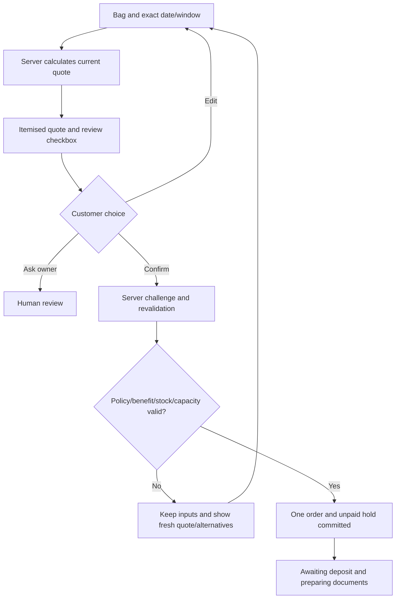
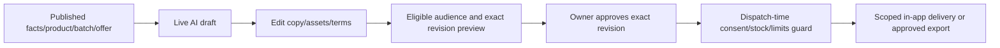

# BizBuddy — App Flow

Version 1.0 · 8 October 2026 · WorkBuddy rebuild target

Related: [PRD](PRD.md), [TRD](TRD.md), [Design](DESIGN_BRIEF.md), [Schema](BACKEND_SCHEMA.md), [Plan](IMPLEMENTATION_PLAN.md).

## 1. Three distinct entry experiences

1. **Product introduction:** `/` explains BizBuddy, shows a user manual/workflow, and offers Set up my business, Continue owner setup and Explore demo shop. It is separate from the demo application. `/guide` expands the manual without opening an authenticated dashboard.
2. **Owner workspace:** verified owner login leads to `/owner/setup` for incomplete setup, otherwise `/owner`. Operations use the grouped sidebar and a separate business AI assistant.
3. **Customer ecommerce:** a public business store `/b/:businessSlug` shows products/services, images and prices. Guests can browse and build a bag; sign-in is required for confirmation, membership, own chat and account records.

Use verified identity after sign-in. Preserve the intended store/destination. A public visitor never sees the local prototype's account/role selector in a production build. An isolated synthetic demo has clearly labelled identities and transaction data.

## 2. Route inventory and navigation parity

Preserve existing routes, with `businessSlug` replacing the bakery-only parameter name without changing the `/b/...` URL shape. Resource `:id` is resolved against trusted scope; a display code is only a label or verified lookup, not authority.

| Route | Access | Purpose |
| --- | --- | --- |
| `/` | Public | Product introduction, workflow/manual, setup and separate demo entry |
| `/guide` | Public | Owner/customer step-by-step user manual; additional final route |
| `/start-business` | Verified registration flow | Business name/slug/sector/fulfilment; real owner creation |
| `/sign-in` | Public authentication entry | Supported Auth; validated return destination |
| `/b/:businessSlug` | Public | Configured store, collection search, All items/Products/Services |
| `/products` | Public alias | Resolve intended/current demo storefront safely; avoid cross-store confusion |
| `/b/:businessSlug/products/:sku` | Public | Image, description, unit price, quantity and Add to bag |
| `/b/:businessSlug/chat` | Scoped customer | Your buddy, live AI/quick actions and explicit order form |
| `/checkout` | Scoped customer | Current business bag → date/window → quote → review/confirm |
| `/account/membership` | Scoped customer | Club perks, join/leave, separate newsletter choice |
| `/account/orders` | Scoped customer | Own order/appointment list |
| `/account/orders/:id` | Scoped customer | Own detail, tracking, payment/balance, documents and support |
| `/account/inbox` | Scoped customer | Approved scoped announcements/offers/service updates |
| `/account/preferences` | Scoped customer | Language, memory, notification/marketing/personalisation/service permissions, correction/deletion |
| `/owner` | Owner | Overview and record-derived operating priorities |
| `/owner/setup` | Owner | Resumable four-step setup and store preview |
| `/owner/agents` | Owner | One customer per agent card; filters and interaction drawer |
| `/owner/orders`, `/owner/orders/:id` | Owner | Search/filter orders, payment verification, status/tracking |
| `/owner/calendar` | Owner | Month/day agenda, orders and internal tasks |
| `/owner/members` | Owner | Customer directory, club/consent summary, pending invite/profile and View buddy |
| `/owner/sales` | Owner | Sales/cash/product overview and invoice register |
| `/owner/stock` | Owner | Stock, lots/movements, forecast, replenishment and price proposals |
| `/owner/reviews` | Owner | Human review queue and exact-proposal decisions |
| `/owner/risks` | Owner | Private risk evidence and clear/block/escalate review |
| `/owner/campaigns` | Owner | Engagement types, audience/revision review, schedule/send/export |
| `/owner/content` | Owner | Live content/image drafts, editing, review and Markdown/SVG/media exports |
| `/owner/assistant` | Owner | Separate live read/query/planning assistant |
| `/owner/business` | Owner | Business profile, products/services/images and club programme |
| `/owner/knowledge` | Owner | Facts/policy preview and versioned publication |
| `/owner/capacity` | Owner | Product/service date capacity and allowed windows |
| `/owner/ethics` | Owner | Personalisation/marketing pause, contact/pricing safeguards |
| `/owner/automation` | Owner | Jobs/reminders/digest/schedule health; demo controls only in demo |
| `/owner/evidence` | Owner | Safe action/source/model/usage/outcome evidence |
| `/owner/customers` | Owner | Conversation archive retained alongside the member/agent views |

Unknown routes show Page not found and a safe return destination. Customer entering an owner route is denied; preserve no private content during loading. On session expiry retain local draft/bag input without leaking the prior user's account data.

Owner sidebar grouping remains:

- Workspace: Overview, Customer agents, Orders & appointments, Calendar, Members.
- Business: Sales & invoices, Stock & forecast, Human reviews, Risk review.
- Growth: Engagement, Content studio, Business assistant.
- Settings & tools: Business setup, Business & catalogue, Business knowledge, Booking capacity, Privacy & ethics, Automation, Activity evidence, Conversation archive.

Settings collapse unless the selected route is inside it. Header search opens with Ctrl/Meta+K, filters page labels/keywords and supports Tab/Enter/Escape. Mobile owner navigation is a labelled modal. Customer top/bottom navigation stays shopping-oriented: Shop, Members, Orders, Help/Your buddy and Bag; account preferences/updates/sign-out remain discoverable.

## 3. New owner and general business setup

Set up my business collects name, unique store slug, industry and pickup/delivery/appointment mode. Server creates the business and grants owner membership only to its verified creator. An idempotent registration request must not create a second business. A conflict preserves input and explains the unavailable slug.

The four setup stages are Make it yours, Build your collection, Set your availability, Preview your storefront. Reuse saved business/catalogue/knowledge/capacity editors. Step completion comes from actual valid published records and eligible availability, not a client “completed” toggle. Closing/reopening setup resumes saved state. Preview opens the matching public store. Return from a preview does not mark unpublished/missing policies complete.

Opening hours, lead time, timezone, allowed fulfilment windows and date capacity are separately editable. A calendar task or open business hour is not a stock/capacity reservation. Adding a product/service makes it visible only after validated publication.

## 4. Browse, bag and membership

The customer can discover the configured business, search names/descriptions, filter product/service types and open item detail. Show current published unit price and accurate image provenance; catalogue price alone does not guarantee availability for a selected date.

Add to bag validates positive integer quantity and merges identical SKUs. Preserve the reference limit of ten unique SKUs and 1–100 units per line unless a documented business policy lowers it. Persist bag by business and guest/customer scope; never store trusted prices or authorisation there. On sign-in transfer a guest bag into an empty same-business customer bag. If that customer already has items, ask for an explicit merge/review rather than overwrite. Signing out shows guest state, not the previous customer's bag. Confirmation success clears only the confirmed bag scope.

Membership page shows current effective percentage, free join/leave and separate Newsletter & offers control. Join changes only club membership. Marketing/newsletter defaults off; leaving the club leaves newsletter preference unchanged. Ordering is available without joining. An owner-paused programme disables new enrolment/benefit as defined by policy and explains the state.

New membership/benefit settings apply through a fresh quote; existing confirmed orders remain unchanged. Show base subtotal, discount/savings, final total and deposit when applicable. An individually approved offer replaces club benefit rather than stacking.

## 5. Checkout, quote and explicit confirmation

All items share the selected fulfilment date/window in the reference checkout. Product/service combinations must be policy-valid; do not invent per-staff/room scheduling. Collect missing values through fields even if chat proposed them.

Quote card shows item/quantity, exact local date/window, price/savings/deposit, quote expiry and “availability is rechecked at confirmation”. The customer reviews the exact proposal and presses Confirm. The UI obtains/uses a short-lived server-bound challenge and retains its action identity while pending. Chat saying “yes” is not a substitute for this control.

Confirmation revalidates price/policy/club/offer versions, lead time and stock/date capacity. Success follows database commit, then displays order code, hold/deposit deadline, tracking and real document states. On timeout show Checking status and query the same action; never suggest creating another order before reconciliation. Stale quote/benefit returns to a fresh review; no silent substitution or acceptance.

## 6. Payment, fulfilment and documents

An awaiting-deposit order displays approved payment instructions, total/deposit and deadline. Synthetic demonstrations never pretend to collect a real bank/card payment. Customer proof upload, if supported, is evidence for owner review only.

Owner order detail includes Verify payment with exact amount/reference and risk review where needed. Verification updates ledger once; reaching required deposit moves held→committed capacity and order→confirmed. Receipt generation is separate. Duplicate reference/excess/blocked-risk/expired hold yields a useful rejection/review state. Late verified funds do not reclaim unavailable capacity automatically.

Customer payment labels are Pending, Partially paid, Paid or Needs review, independently of fulfilment. Owner progresses confirmed→preparing→ready→delivering→completed; pickup/appointment can complete from ready after full balance. “Delivered” can appear as a timestamped delivery event. No carrier tracking or settlement is invented.

Quote PDF can exist before an order. Summary/invoice relate to committed order; receipt relates to verified payment. Show Preparing, Available or Failed and actual authorised download. A failed document job does not erase the order or require new confirmation. Cancelled/expired orders retain history/documents, accurate balances and review outcomes.

## 7. Customer AI, memory and after-sales

Your buddy clearly identifies itself as an AI assistant, offers human help and quick actions View products, Order again, New order, Check order and Ask owner. Structured forms remain usable without AI.

Flow: save scoped message → bound its run/time/budget → retrieve published facts and permitted own context → call allowlisted tools → validate result → save answer/card/source/action outcome. Show Working status; polling resumes from saved run. BM/English/mixed-language language handling changes wording, not commercial facts.

Repeat order loads this customer's latest eligible completed order. Ask for missing date/window or clarify “next Saturday”; recalculate at current prices and display ordinary quote/Confirm. No history gives neutral catalogue choices. Preference memory/personalisation must have current permission; propose extracted preference with an explicit save choice. Correction/deletion changes future recall and derived optional summaries.

Recommendations show real current product/offer and a short reason based on the current request or permitted context. Selection returns to normal ordering. Support/complaint/refund/dietary-safety questions open a case with customer transcript/context and owner-contact route. Optional after-sales check-in requires separate permission and cannot carry an unsolicited upsell.

AI timeout/rate/credit/provider failure preserves the message and shows truthful fallback choices/form/tracking/human help. A malformed/contradictory amount never replaces the authoritative card. Unsupported ambiguity asks a concise question or hands off, rather than fabricating a committed result.

## 8. Owner agent board and human review

Agents page has exactly one card per business/customer, including no interaction and inactive history. All/Active/Inactive/Needs review filters and customer search work on saved projections. Show customer/code, lifecycle, processing state, latest interaction/time, current task/review reason, message/order/verified-payment counters and Open interaction.

Opening interaction uses a focused drawer with transcript, orders/cases, safe actions and Take over/Reply/Resume. `/owner/agents?customer=<id>` opens the matching authorised card/drawer; Members → View buddy uses this path. Multiple conversations stay under one customer card. Closing/Escape restores focus to the source card/link.

Takeover is an explicit persisted flag; stop conflicting runs/customer sends even if their job was already queued. Owner reply is saved as owner, not AI. Resolve review, then explicitly Resume; resolving a case alone does not accidentally resume paused automation.

Reviews show exact proposal/message, reason, affected amount/order/policy/version/expiry and Approve/Edit/Reject. Editing creates a new revision and invalidates approval. Approved commercial exceptions yield a new quote for customer acceptance. Refund execution remains a human case outcome, not a fictional transfer. Risk review clearance is separate from payment verification.

## 9. Overview, sales, stock, forecast, calendar and pricing

Overview offers four linked operating cards: active orders, non-cancelled booked value, verified payments and human reviews. Upcoming fulfilments are actual orders with names/windows/amounts; order-stage chart has saved counts and accessible legend. Attention links select saved review/order filters. Show current business time/timezone and appropriate Automation link. Every KPI opens its underlying record filter.

Orders search code/customer/items and support status/date filters. Sales shows booked/completed/cancelled values, verified cash, unpaid/reconciliation amounts, per-product lines and actual invoice register. Members search name/code and show orders/payment/club/consent summaries; Invite/Add profile uses a labelled modal, validated identity workflow and post-save feedback.

Stock shows physical on-hand/allocated/sellable, movement history, lots/expiry/waste and a distinct date-capacity panel. Receipt/adjustment needs quantity/reason/version; concurrent or below-reserved adjustment is rejected. Services display capacity rather than stock.

Forecast shows cutoff/horizon/history coverage/method, actual-versus-projected values, current price assumption, known-bookings split and production/replenishment/overflow suggestion. No usable history displays Insufficient data; synthetic simulations are explicit. A plan is advisory. Suggest dynamic price → save bounded proposal → owner reviews reason/source versions/validity → Approve and publish or Reject. Publication updates future quote versions uniformly and leaves old orders untouched.

Calendar month/day view combines saved order/appointment windows with internal tasks. Create/complete task does not reserve capacity. Long day agendas and mobile views remain navigable. Owner assistant can explain these reports with source links; financial/publication requests lead to their explicit reviewed form.

## 10. Campaigns, content and visual generation

Engagement starts with Announcement, Recommendation, Promotion or After-sales. Fresh-batch claims require an actual sellable lot; promotions require approved published offer terms. Choose product/batch, language, draft/copy/assets, audience rules and schedule. Preview eligible recipient count plus exclusions without exporting unnecessary private data. Any change to terms/copy/assets/audience invalidates prior approval.

Content studio supports product/SEO, marketing, personalised email/newsletter, social and PR copy. Generate with actual Tencent model, edit title/body/meta/alt text/headline/colour, review facts/language and export actual Markdown. BM/English drafts retain facts; Chinese is a draft needing translation review.

Visual generation saves job ID and states Queued/Generating/Ready for review/Approved/Failed/Blocked. Navigation/reload retains job status. Store real provider output privately with provenance/rights/alt text. Compose approved imagery with editable branded headline/colour/layout and export real SVG/media. A template may remain an editing tool but cannot impersonate successful image generation.

Dispatch rechecks current purpose/channel/personalisation/service permission, unsubscribe, quiet hours, caps, pause, takeover, offer expiry and sellable batch. Opt-out after scheduling suppresses. In-app delivery appears in the recipient's own updates. External email/social is available only with supported restricted connector and actual acknowledgement; otherwise show approved export. Uncertain external delivery requests review before retry.

## 11. Durable automation and demo controls

Automation shows persisted jobs, schedules, last actual run, processed/suppressed/failed/uncertain outcomes, pause and eligible retry. WorkBuddy Automation invokes bounded backend processing/digest rather than unguarded publication. Backend expiry checks run during allocation even while desktop scheduling is offline.

In isolated synthetic demo, show clock current time/Pause/Resume/Advance, Run due jobs, Generate digest and explicitly confirmed Reset demo. Reset restores only that environment's synthetic records/files/clock, and stops conflicting workers safely. Production exposes no demo clock/reset/role-selector paths.

A deposit reminder confirmed at 7 October 2026 10:00 is due at 22:00 and defers to 8 October 09:00. At 10:00 the unpaid hold expires. Manual runs enforce all eligibility and duplicate guards. Digest links to underlying order/payment/review/job figures.

## 12. Required non-happy-path behaviour

| State | Customer outcome | Owner/recovery outcome |
| --- | --- | --- |
| Empty collection/filter | Clear empty text and reset search/filter | Setup link for missing published catalogue |
| Auth expired/denied | Sign in again; no other-user record flash | Audited scope denial, no role switch |
| Model offline/limited | Saved message; fallback/form/track/human help | Provider/rate/budget status and recoverable run |
| Write pending/timeout | Checking status using same action ID | Reconcile committed outcome before retry |
| Quote/benefit/offer stale | Fresh proposal requiring review | Source/version reason, old order unchanged |
| Stock/capacity unavailable | Keep inputs; choose alternatives or ask owner | No partial order/allocation |
| Human takeover | Waiting for owner; saved case | Transcript/reply; explicit resume |
| Payment risk/late hold | Awaiting verification/review | Reasoned review plus separate ledger decision |
| Document/image failed | Existing order survives; file unavailable | Error/eligible retry, no fake preview/download |
| Consent withdrawn | Club/order access intact; targeting stops | Queued sends suppressed with reason |
| Uncertain external send | No “Delivered” claim | Review before potentially duplicate retry |

WorkBuddy verifies these flows at their phase-end gates and final PRD A01–A18 acceptance. All quoted screens are target behaviour, not a claim of completed WorkBuddy implementation.
