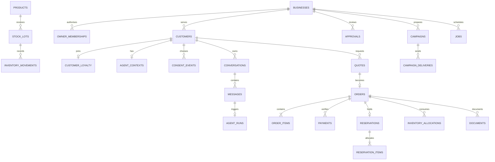

# BizBuddy — WorkBuddy Backend / Database Schema

Version 1.0 · 8 October 2026 · Fresh WorkBuddy migrations required · Database implementation: Not started

This is the requested “Background Schema”, interpreted as the backend/database schema. Visual backgrounds are in [Design Brief](DESIGN_BRIEF.md). Related: [PRD](PRD.md), [TRD](TRD.md), [App Flow](APP_FLOW.md), [Plan](IMPLEMENTATION_PLAN.md).

## 1. Storage and invariants

WorkBuddy independently generates migrations for a separate Tencent-hosted PostgreSQL database. Verify its actual supported SQL transport, transactions, row locks, identity mapping and RLS in WB0/WB1. Do not copy the prototype database, blindly reuse local Windows setup or edit already-applied migrations. Private documents/assets use CloudBase storage with database metadata and scope.

- IDs are UUID; human order/customer codes and store slugs are separate labels. Provider subject is opaque text, never assumed to be a customer UUID.
- Every business record has `business_id`; customer-owned records also have `customer_id`. Parent/child scope consistency is protected by composite foreign keys.
- Money is non-negative `BIGINT` integer sen. Validate safe API conversion and preserve the reference maximum order total of 10,000,000 sen; no JavaScript floating-point commercial arithmetic.
- Policy/discount rates are integer basis points. Deposit uses ceiling division; discounted per-unit price uses floor division as specified in PRD. Snapshot base/discount/final values and reconcile line/order totals.
- Local fulfilment dates use `DATE`; windows/opening hours use local time in business timezone; events/deadlines use `TIMESTAMPTZ`. Production uses real time. Demo deadlines use an isolated business clock; rate limits/leases/budgets always use wall time.
- Mutable objects have `version`, `created_at`, `updated_at`. Published content, commercial snapshots, ledger/consent/audit events are immutable except narrowly allowed lifecycle metadata/corrections.
- Keep schema-validated JSON for policy, quote snapshots, tool cards and minimised evidence. Critical identity/order/payment/allocation relations use explicit foreign keys, not JSON-only references.
- Synthetic records have explicit mode/origin. Exclude them from real-pilot model/forecast metrics. Optional preference deletion never cascades to orders/payments.

## 2. Principal relationships

The following inventories define the additional relationships. Naming can be adapted in new source if all contracts/constraints remain documented and tested.

## 3. Identity, business configuration and consent

| Table | Important fields | Constraints/meaning |
| --- | --- | --- |
| `businesses` | id, slug, name, timezone, status, active_knowledge_version_id, automation_paused, is_synthetic, version | Unique slug; active knowledge pointer must belong to same business |
| `business_profiles` | business_id, sector, fulfilment_mode, contact/public_description, opening_hours_json, ethics_json, version | One/business; fulfilment pickup/delivery/appointment; typed hours/ethics; private/public fields separated |
| `owner_memberships` | business_id, auth_provider, provider_subject, role, active | Unique business/provider/subject; owner role created by verified registration/invite flow, never prompt |
| `business_registrations` | request_id, verified_subject, payload_hash, business_id, state, created_at | Idempotent bootstrap bound to verified subject; changed payload/other subject denied |
| `customers` | id, business_id, nullable provider/subject before verified link, display_code/name, language, status, is_synthetic, version | Unique business/id, business/code and verified provider identity; no matching by display name |
| `customer_invitations` | id, business_id, customer_id, token_hash, intended_identity_hash, expires_at, accepted_at, created_by | Single-use hashed invitation; identity proof required; token/logs cannot grant owner authority |
| `consent_events` | id, business_id/customer_id, purpose, channel, granted, sequence, captured_at, notice_version, source | Append-only; sequence gives unambiguous latest choice even with equal timestamps |
| `consent_current` | business_id/customer_id, purpose/channel, granted, event_id, version, changed_at | Transactionally maintained projection or latest-event view; source event is authoritative |
| `customer_preferences` | id, scope, key/value_json, source_message_id, consent_event_id, version, deleted_at | Unique active key/customer; write only with current memory permission and explicit acceptance |
| `derived_customer_memory` | id, scope, source_ids, purpose, summary/embedding_ref, consent_version, expires_at, deleted_at | Optional minimised memory; invalidate/delete on consent withdrawal/source deletion; not global WorkBuddy memory |
| `loyalty_programs` | business_id, enabled, discount_basis_points, version | One/business; rate 0–1500, effective rate also bounded by ethics |
| `customer_loyalty` | business_id/customer_id, active, joined_at, left_at, version | Exactly one/customer; club membership separate from roles/consents |

Consent purposes: `preference_memory`, `operational_reminders`, `marketing`, `personalisation`, `service_followup`. Channel initially `in_app`, with explicit email/social channel grants only if those connectors are added. Newsletter UI writes marketing consent; club join writes only loyalty. Joining/leaving cannot implicitly change any consent. Owner customer-directory access is limited to business operations; it does not grant export of arbitrary personalisation data.

`ethics_json` is schema-versioned: personalisation_enabled, marketing_enabled, daily_contact_limit (default 1), promotional_cooldown_days (default 7 for final agent), max_discount_percent (default 15), max_increase_percent (default 10), optional product price floors/ceilings. Preserve daily contact controls even with the extra weekly cooldown.

## 4. Published catalogue, knowledge and fulfilment policy

| Table | Important fields | Constraints/meaning |
| --- | --- | --- |
| `knowledge_versions` | id, business_id, version_number, state, policy_json, published_at/by, content_hash | Unique business/version; draft/published/retired; published payload immutable |
| `knowledge_entries` | id, business_id, knowledge_version_id, fact_key/category, content_bm/en, approved_sources | Unique version/fact; facts are owner-approved, not imported instructions |
| `products` | id, business_id, sku, kind, inventory_mode, active, image_key/approved_media_id, batch_size, shelf_life_hours, version | Unique business/SKU; kind product/service; inventory untracked_preorder/tracked; services capacity-only; referenced kind cannot change casually |
| `catalogue_items` | id, business_id, knowledge_version_id, product_id, label/description, units_description, unit_price_sen, available | One product/version; price positive for fixture products; historic versions retained |
| `product_media` | id, business_id, product_id, asset_id or storage_key, origin, alt_text, rights/approval/version | Public publication only after review; illustration/photo provenance required |
| `fulfilment_slots` | id, business_id, code, start_local/end_local, active, version | Unique business/code; start<end; exact timezone/window used in quotes |
| `capacity_buckets` | id, business_id, product_id, fulfilment_date, max_units, held_units, committed_units, version | Unique business/product/date; nonnegative counts; held+committed≤max |

Policy JSON schema includes currency, lead_time_hours, deposit_basis_points, quote_lifetime_minutes, hold_lifetime_hours, reminder_delay_hours, quiet_hours_start/end, approval_lifetime_minutes, allowed_exception_types and fulfilment modes/windows. Default values are PRD fixtures. Reject invalid/missing mandatory policy before activation. Business opening hours and reservable capacity are separate concepts.

Reference illustration keys remain parcel/brownie/cupcake/flower/service. New uploaded/generated media uses reviewed asset metadata, not arbitrary external URLs or browser-held private storage secrets.

## 5. Customer/owner conversations and AI state

| Table | Important fields | Constraints/meaning |
| --- | --- | --- |
| `agent_contexts` | id, business_id/customer_id, lifecycle, takeover, current_task, last_interaction_at, version | Unique business/customer; lifecycle eligible/inactive/paused; exactly one logical buddy across conversations |
| `conversations` | id, scope, context_id, state, language, human_takeover, timestamps | active/waiting_owner/closed; immutable scope |
| `messages` | id, scope, conversation_id, role, content, structured_payload, source_action_key, created_at | customer/assistant/owner/system; immutable content; unique business/source key for dedup |
| `agent_runs` | id, scope, conversation_id, input_message_id, state, model_binding/id/revision, prompt_version, started_at/deadline/finished_at, usage_json, error_code, correlation_id | Unique input message; queued/running/completed/fallback/failed/cancelled; bounded and ordered per conversation |
| `agent_tool_events` | id, business_id/customer_id, run_id, step_number, tool_name, input_hash, safe_result, source_refs, duration_ms, outcome | Only actual invocations/outcomes; no secrets/private reasoning; enforce step/tool budget |
| `owner_conversations` | id, business_id, owner_subject, state, timestamps | Separate owner query history; never joined into customer memory/retrieval |
| `owner_messages` / `owner_agent_runs` | owner_conversation_id, business_id, message/run fields analogous above | Owner registry identity/usage; safe report/draft tools only |
| `support_cases` | id, scope, conversation_id, order_id, kind, reason/summary, state, takeover, assigned_owner, resolution, version | Saved complaints/after-sales/refund requests; only authorised owner resolves; no refund ledger fiction |

Structured cards contain typed object IDs/versions/results, not trusted roles or arbitrary HTML. Bind source references to current published knowledge and scoped history. One live run per conversation uses a partial unique constraint/lease or ordered queue; enforce customer-wide concurrency as specified by TRD. Processing status is a projection of runs/jobs/reviews, distinct from lifecycle. Card counters are queries over saved messages/orders/verified payments, never stored fake KPI constants.

## 6. Quotes, challenges, orders, payments and tracking

| Table | Important fields | Constraints/meaning |
| --- | --- | --- |
| `quotes` | id, scope, knowledge_version_id, items_json, fulfilment_date/slot_id, base_total_sen, discount_sen, total_sen, deposit_sen, benefit_json, offer_revision_id, approval_id, proposal_hash, expires_at, state | Immutable pricing/eligibility snapshot; active/accepted/expired/superseded; deposit≤total; base−discount=total; no capacity hold |
| `confirmation_challenges` | id, scope, quote_id, proposal_hash, token_hash, expires_at, consumed_at | Single-use, hashed, actor/quote/hash-bound; no raw token in model/history |
| `orders` | id, scope, display_code, quote_id, knowledge_version_id, fulfilment_date/slot_id/mode, total_sen, deposit_required_sen, pricing_snapshot, state, exception_paused, version | Unique accepted quote→order; monetary snapshot immutable; all permitted transitions explicit |
| `order_items` | id, scope, order_id, product/catalogue_item_id, sku/label_snapshot, quantity, base_unit_sen, discount_basis_points, unit_price_sen, line_total_sen | Positive integer quantity; line=quantity×unit; scoped product/catalogue FK and sum reconciles order |
| `reservations` | id, scope, order_id, state, expires_at, committed_at, released_at | One/order; held/committed/released; release once |
| `reservation_items` | scope, reservation_id, capacity_bucket_id, quantity | Unique reservation/bucket; quantity>0; scoped bucket/product/date agreement |
| `payment_attempts` | id, scope, order_id, submitted_amount/reference, proof_asset_id, risk_state, created_at | Optional unverified evidence; never counts as cash/receipt |
| `payments` | id, scope, order_id, amount_sen, reference, state, verified_by/at, is_synthetic, verification_action_id | Positive amount; unique business/reference; verified/voided; owner action required |
| `payment_corrections` | id, scope, payment_id, correction_kind, reason, owner_subject, occurred_at | Audited append-only correction; no silent deletion of verified ledger |
| `order_tracking` | id, scope, order_id, event_type, prior_state/new_state, actor, note, source_action_key, occurred_at | Append-only trusted transition/event; dedup key; owner/customer safe projection |

Order states: awaiting_deposit, confirmed, preparing, ready, delivering, completed, cancelled. Quote draft/review happens before order creation. Payment display state derives from verified total and review context; it is not a writable order paid flag. Full verified balance is required for completed. Keep invoice/original amounts on cancellation; show payment reconciliation/refund case separately.

Benefit snapshot: member_version, program_version, ethics_version/effective_basis_points, base/final per-unit values and savings. An approved offer replaces the benefit and includes its own revision/eligibility/redemption snapshot. Stale unconfirmed entitlement rejects/requotes. A later club exit/programme/price edit never rewrites an accepted order.

## 7. Physical inventory, lots, forecasts and pricing

| Table | Important fields | Constraints/meaning |
| --- | --- | --- |
| `stock_lots` | id, business_id, product_id, batch_code, origin, received/produced_at, expires_at, quality_state, version | Product-only; unique business/batch code; valid expiry ordering; service cannot receive lot |
| `inventory_movements` | id, business_id, product_id, optional lot_id, signed_quantity, kind, order_id, reason, source_action_key, created_by/at | Append-only receipt/adjustment/fulfilment/waste/expiry/cancel_restore; no zero event; immutable/deduped |
| `inventory_allocations` | id, scope, order_id/item_id, product_id, optional lot_id, quantity, state, source_action_key | Positive quantity; held/committed/consumed/released; no duplicate fulfilment allocation |
| `demand_observations` | business_id/product_id/date, fulfilled_units, eligible_order_units, observed, stockout_constrained, is_synthetic, source_version | Derived reproducible daily series; missing≠zero; no duplicate source quantity |
| `forecast_runs` | id, business_id, cutoff, horizon_days, method/version, data_mode, input_hash, history_coverage, backtest_json, state, expires_at | Immutable result inputs; synthetic/real distinguished; results stale after relevant changes |
| `forecast_points` | forecast_id, business_id/product_id/date, demand_units, known_units, incremental_units, low/high, interval_kind, price_assumption_sen | Unique run/product/date; metadata identifies heuristic/calibrated/unavailable intervals |
| `production_plans` | id, business_id, forecast_id, product/date, suggested_units, stock/capacity/lot_versions, reasons, state, reviewed_by | Advisory proposal; owner acceptance does not invent a stock receipt/purchase |
| `price_proposals` | id, business_id/product_id, knowledge/forecast/stock/ethics_versions, old/new_price_sen, bounds/reasons, proposal_hash, expires_at, state, approved_by/at, published_version_id | pending/approved/rejected/expired/superseded/published; owner exact-version decision; integer bounds |

On-hand is the signed ledger total; allocated is live unconsumed held/committed allocation; sellable availability is usable on-hand minus those allocations, excluding expired/quarantined lots. Avoid double subtraction when an allocation is consumed at Ready and its movement is already debited. Untracked preorder products use date capacity; tracked stock and daily production quotas remain separately enforced.

Legacy un-lotted movements remain valid reference behaviour; final lot-aware receipt enables accurate fresh/expiry claims. FEFO allocation can be implemented for perishable goods with deterministic sorted locks. A stock reduction/expiry that conflicts with committed goods creates explicit shortage review rather than a hidden negative balance. Ready debit and cancellation restore occur at most once per applicable item/source key. Completed orders retain consumed production capacity for their fulfilment date.

Forecast input rules/cutoff/known-order split must be written alongside the service. Do not count expired unpaid/cancelled or synthetic pilot transactions as real demand. Preserve baseline overview even without an optional ML library. All projections show sufficiency and assumptions; sales-value projection uses declared prices, not invented future revenue.

## 8. Offers, campaigns, recommendations, content and assets

| Table | Important fields | Constraints/meaning |
| --- | --- | --- |
| `offers` | id, business_id, kind, current_revision_id, state, version | Published owner-approved promotion/exception entitlement; no model-granted discount |
| `offer_revisions` | id, business_id/offer_id, revision, eligible_product/customer/audience rules, discount_basis_points, maximum_uses, per_customer_limit, starts/expires_at, terms_hash, approved_by | Immutable exact terms; bounded ethics; no stacking with member benefit |
| `offer_redemptions` | id, scope, offer_revision_id, order_id, quantity/savings_sen, source_action_key | Unique order/offer and scoped limits; claim atomically with order |
| `recommendations` | id, scope, product/offer_revision_id, basis, source_refs, consent_version, created/expires_at | Valid catalogue/current-request or permitted personalisation; advisory, no reserved goods |
| `campaigns` | id, business_id, kind, current_revision_id, state, created_by, version | announcement/recommendation/promotion/after_sales; draft/pending/approved/scheduled/completed/cancelled |
| `campaign_revisions` | id, business_id/campaign_id, revision, language, copy, product/lot/offer/content/asset refs, audience_rule, source_versions, proposal_hash, approved_by/at, expires_at | Immutable exact revision; edits create new revision and invalidate previous approval |
| `campaign_deliveries` | id, scope, campaign_revision_id, channel, action_key, state, due/delivered_at, suppression_reason, provider_receipt, last_error | Unique business/revision/customer/channel; queued/delivered/suppressed/failed/delivery_uncertain |
| `contact_events` | id, scope, purpose/channel, source_action_key, delivered_at | Actual contact only; cross-channel daily/weekly caps checked; no fake delivery for exports |
| `content_drafts` | id, business_id, kind, current_revision_id, state | SEO/product/marketing/email/newsletter/social/PR; persists editing/export workflow |
| `content_revisions` | id, business_id/draft_id, revision, language, title/meta/body/alt, prompt_version, model/ref, fact_refs, terms_hash, asset_refs, review_state, content_hash | Immutable draft revision; BM/EN/Chinese review state; approval bound to exact facts/assets |
| `assets` | id, business_id, origin, provider/model/revision, prompt_hash/fact_refs, storage_key, content_hash, mime/dimensions, alt_text, rights_state, review_state, visibility | Genuine photo/generated illustration/vector composition; private by default; only approved media public |
| `asset_jobs` | id, business_id, requesting_owner, idempotency_key, provider_job_ref, status, deadline, usage/budget_ref, asset_id, last_error | queued/generating/ready_for_review/approved/failed/blocked/cancelled; actual generation provenance |
| `asset_compositions` | id, business_id, asset_id, headline, colours/layout_json, revision, export_asset_id | Editable poster/SVG workflow remains functional alongside live generated images |
| `export_events` | id, business_id, revision/asset_ref, kind, content_hash, actor/time | Actual file export outcome; cannot count as delivered email/social publication |

Audience preview stores criteria/version/hash and eligible count; avoid durable unnecessary raw recipient exports. Dispatch rechecks current permissions and eligibility. Personalised campaign context is customer-scoped and minimised. Fresh Orange Cake announcement must reference a real published SKU/sellable batch; no seeded successful announcement constant.

Use typed references and scope-consistent foreign keys wherever critical; JSON fact/audience rules are allowlisted schemas, never arbitrary SQL/filter expressions. Public generated asset visibility is a deliberate review transition. Asset URLs returned by providers are temporary retrieval information, not permanent public keys or files.

## 9. Approvals, risk, calendar and security controls

| Table | Important fields | Constraints/meaning |
| --- | --- | --- |
| `approvals` | id, scope, kind, order/conversation/support_id, proposal_json/hash, policy/source_versions, state, expires_at, decided_by/at/note, version | pending/approved/rejected/expired/superseded; owner UI decision; financial offer requires customer reacceptance |
| `risk_cases` | id, scope, order/payment_attempt/payment_id, rule_version, signals/evidence_min, score_kind, state, hold_until, reviewed_by/reason, version | open/cleared/blocked/escalated; risk alone does not verify payment/ban/refund |
| `abuse_events` | id, business_id/customer_id or minimised unauthenticated key, category, request_hash, rule_version, cooldown_until, safe_reason, created_at | Spam/velocity/injection/rate event; retain minimally; no sensitive profiling |
| `rate_limit_buckets` | key_hash, business/subject purpose, window_start, count, expires_at | Atomic shared counters; defined retention; IP hash is auxiliary, not identity |
| `ai_budget_reservations` | id, business_id, subject/run/job_id, day, estimated_units, actual_units, state, expires_at | Atomic daily quota reservation/settlement; provider-reported cost separately nullable |
| `provider_circuit_state` | binding_key, failure_window/count, state, reopen_at, probe_lease | Shared provider circuit breaker prevents retry storms |
| `calendar_events` | id, business_id, title, kind, starts/ends_at, state, owner_subject, optional order_id, version | Internal task/open/completed; order agenda may be derived; calendar cannot reserve capacity |
| `audit_events` | id, scope, actor_type/subject, action, entity_type/id/version, source_refs, correlation_id, outcome, safe_details, occurred_at | Append-only actual operations; no credentials or private reasoning; model versus owner UI actor distinguished |

Avoid unchecked polymorphic references for approval decisions. Use explicit allowed target columns/link tables and constraints proving the correct target, scope and revision hash. Expiry/clearance must be recoverable; a risk hold cannot silently alter immutable payment or confirmed price data.

## 10. Jobs, documents, outbox and idempotency

| Table | Important fields | Constraints/meaning |
| --- | --- | --- |
| `jobs` | id, business_id, optional customer/order scope, kind, payload_json, action_key, state, due_at, attempts, lease_owner/until, deadline, last_error | Unique business/action key; queued/running/completed/suppressed/failed; bounded retry; worker validates payload references |
| `outbox_events` | id, scope, kind, entity_id, action_key, payload_json, state, timestamps | Inserted in business transaction; delivery independent; unique action key |
| `documents` | id, scope, quote/order/payment_id, kind, revision, state, storage_key, content_hash, supersedes_id, created_at | Quote tied to quote; summary/invoice to order; receipt to verified payment; private and scope checked |
| `idempotency_records` | id, business_id, actor_subject, operation, key, request_hash, state, result_json, expires_at | Unique actor/business/operation/key; mismatch rejected; result only after commit; retain beyond retry window |
| `owner_digests` | id, business_id, reporting_start/end/timezone, data_cutoff, metrics_json, source_filter_hash, generated_at | Persisted record-derived digest; totals generated with same report services |
| `automation_runs` | id, business_id, trigger_source, action_key, started/finished_at, counts/outcome, safe_error | Actual WorkBuddy/backend/manual run evidence, not scheduled-success fiction |
| `demo_clock` | business_id, base_demo_time, wall_anchor, paused, version | Synthetic environment only; separate wall-clock leases/rate/quota |

Document kind/reference constraints prevent unbound receipts. Add unique quote/kind/revision, order/kind/revision and payment/receipt/revision as applicable. Private storage path embeds scope-safe IDs, but a path alone is not authorisation. Authorised download checks metadata and current identity before streaming/issuing short-lived access.

Worker lease defaults are in TRD. Use `FOR UPDATE SKIP LOCKED` or verified equivalent for bounded claiming; recover expired leases using wall time. Long image jobs use renewable/provider-specific leases, not a short lease causing duplicate image calls. Outbox/document/send keys survive process restarts.

## 11. Composite integrity and indexes

For business-owned parents provide `UNIQUE(business_id,id)`; customer-owned parents provide `UNIQUE(business_id,customer_id,id)`. Children reference those full tuples. Also bind product/catalogue/knowledge, offer/redemption, lot/product and document/payment/order scopes. Use `ON DELETE RESTRICT` for commercial records; optional-memory lifecycle uses explicit authorised deletion.

Required unique/integrity constraints include:

- business slug; business/customer display code; verified subject mapping; one agent context and one loyalty record/customer.
- one accepted quote/order; one reservation/order; one challenge use; one business payment reference.
- one source-key stock debit/restore, message/reminder/delivery/document action; idempotency actor/operation/key.
- nonnegative/bounded capacity counts; positive quantities; exact line sums; payment outstanding validation inside locked service.
- one in-flight run/conversation; stock availability checks under the same lock protocol rather than an unsafe isolated sum constraint.

Indexes: orders `(business_id,fulfilment_date,state)` and `(business_id,customer_id,created_at DESC)`; messages `(business_id,customer_id,conversation_id,created_at,id)`; agent contexts `(business_id,lifecycle,last_interaction_at)`; pending approvals/risk `(business_id,state,expires_at)`; due jobs `(due_at,id)` partial queued and expired-lease lookup; held reservations `(business_id,expires_at)`; inventory `(business_id,product_id,lot_id,created_at)`; lot expiry; consent latest-event sequence; campaign recipient/action and contact-period indexes; document parent/revision; payments/report date; forecast cutoff/product. Avoid redundant indexes already covered by leading composites.

## 12. Authorisation and RLS

Separate migration/admin, application, restricted owner-integration and worker database roles. Runtime must not be table owner, superuser or BYPASSRLS. Enable/force RLS where supported and prove the actual deployed access path. Privileged manager SDK access must not accidentally bypass the policy contract.

Set trusted transaction-local business/customer/subject/actor scope only after server Auth verification; deny missing scope. Scope clears with transaction end, including errors/pool reuse. A browser/model cannot issue arbitrary SQL or set role/context. Customer models receive only narrower tool capabilities; an authenticated owner query model does not inherit all owner UI mutation permissions.

| Family | Public | Customer | Owner UI | WorkBuddy integration/worker |
| --- | --- | --- | --- | --- |
| Published store/media | Narrow published read | Published read | Configure/review | Approved facts only |
| Identity/club/consent/memory | No private access | Own explicit choices | Scoped necessary directory/programme management | Purpose-minimised context; no role mutation/raw export |
| Customer conversations/orders/support | None | Own reads/controlled services | Business-scoped operational read/reply | Narrow run/job context, no unrestricted transcript export |
| Payment/approval/price/content decisions | None | Confirmation of own exact quote only | Explicit authorised decision service | No verification/approval/publication privilege |
| Capacity/inventory/ledger | Published availability output only | Own proposal/status output | Controlled invariant-preserving services | Read planning summary/approved processing only |
| Private docs/assets | Approved public catalogue media only | Own permitted documents | Business-scoped review/download | Guarded generation/storage, not public arbitrary retrieval |
| Jobs/audit/budgets | None | Own safe status | Scoped inspect/pause/eligible retry | Fixed-business bounded functions; safe summaries |

If a security-definer projection/function is needed, set a fixed safe search path, validate trusted actor/business, accept only allowlisted inputs and expose narrowly granted execution. Public store function cannot return synthetic accounts. Owner verification/approval endpoints require explicit UI action/session/CSRF/version checks, and their credentials/capabilities are absent from model/MCP tool closures.

## 13. Transaction contracts

### Confirm quote

1. Verify customer scope and canonical idempotency payload; lock/reconcile same-key result.
2. Validate challenge/token hash/quote/scope/expiry and exact proposal. Recheck active catalogue/policy, member/ethics/offer and customer-specific entitlement.
3. Acquire stable business/date/product locks shared by confirmation/payment/expiry/stock/status operations; sort all keys and rows. For the small app a coarse per-business advisory lock is acceptable and documents a throughput tradeoff.
4. Reconcile expired unpaid holds; lock capacity plus tracked stock/lot allocations; reject insufficient units without partial writes.
5. Validate/claim offer redemption limits if applicable; insert order/items/reservation/capacity allocation/stock allocation and increment held counts.
6. Consume challenge/mark quote accepted; insert document/reminder outbox, tracking/audit and idempotency success together.
7. Commit, then report Reserved — awaiting deposit. A transaction rollback creates no success message.

### Verify payment, expire, cancel or fulfil

Use the same stable locks; lock order/reservation/payment reference/risk and relevant allocation. Owner verification rejects duplicate/excess/unresolved blocked-review input. Valid deposit threshold within a live hold moves held capacity to committed without increasing total booked units. Queue receipt from verified ledger. If the hold expired, save the review outcome/evidence and do not auto-reclaim unavailable capacity; any recorded late verified cash remains explicitly requiring reconciliation.

Expiry/cancellation release allocation once and suppress obsolete jobs. Cancellation of consumed stock restores once only where business policy makes the goods usable; otherwise record waste/disposition, never fake sellable stock. Fulfilment Ready consumes the tracked allocation/debits once. Completing requires full balance; completed date capacity remains consumed. Every state transition/tracking row is committed with the underlying state.

### Withdraw consent and deliver campaign

Consent change appends event and updates current version under customer/consent lock; invalidate optional memory/recommendations and pending eligibility. Delivery acquires the same customer guard, rechecks revision/consent/stock/offer/caps/takeover/pause, inserts actual in-app message/contact/delivery outcome or suppression and commits. External sends use durable action ID and connector idempotency; uncertain acknowledgement is reviewed before retry. Do not promise strict atomic exactly-once behaviour for a connector lacking it.

### Approve revision, publish and generate asset

Lock current proposal/revision and source versions. Owner exact-hash approval expires/invalidates on relevant change. Price publication creates a new catalogue version; offer/campaign/content publication references approved revision. Model/job can prepare draft but cannot approve it. Asset job reserves budget then calls provider outside transaction; persist output and settle usage in short idempotent updates; failure is durable. Approval/public exposure occurs later via owner review.

## 14. Migration, seeds, recovery and gates

WorkBuddy creates ordered migrations, checksum tracking, restricted grants and typed fixture scripts. Use disposable synthetic databases for migration/phase-end tests. Seed definitions in PRD are sufficient to generate new fixtures; retained prototype screenshot records are not mandatory production UUIDs. No live customer data is imported by this task.

Verify fresh migration/replay and isolation in WB1; money/confirmation/expiry races in WB2; allocation/report/price/risk/calendar in WB4; jobs/private files/receipt/restart in WB5; tool scopes/rate/budget/memory in WB6; offer/generation/consent-dispatch/revision in WB7; full integration once in WB8 and actual deployment path in WB9. Run only at completed phase gates and preserve earlier passing evidence.

Configure backups/recovery and data retention before real pilot. Optional profile/embedding deletion is separate from required financial/audit retention. Before a destructive real-data migration, create a verified backup and explicit reviewable migration plan. Synthetic reset is constrained to the isolated demo database/business and its owned private files; it must never target external/production data.
