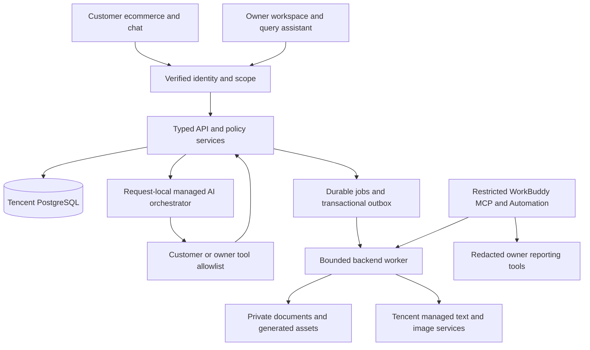

# BizBuddy — Technical Requirements Document

Version 1.0 · 8 October 2026 · WorkBuddy/Tencent target · No runtime or account capability has been verified for this rebuild

Related: [PRD](PRD.md), [Schema](BACKEND_SCHEMA.md), [App Flow](APP_FLOW.md), [Design](DESIGN_BRIEF.md), [Plan](IMPLEMENTATION_PLAN.md).

## 1. Architecture and authoring boundaries

WorkBuddy builds a new application in a fresh workspace from these requirements and prototype screenshots. Generate new frontend/backend source, database migrations, agent orchestration, tests and deployment configuration. Retain all PRD F01–F25 workflows. Existing Codex source may explain behaviour but is not the final deployment package. Final slides/documentation are also authored in WorkBuddy.

WorkBuddy is the development/operations environment; the customer-facing browser uses a scoped backend agent runtime. Do not assume customers can invoke the owner's desktop WorkBuddy session or that a desktop automation is a public customer API. One customer context does not require one permanently running process.



Never hold a database lock/transaction while waiting for a model or image provider. Retrieve minimised context, call AI with a bounded budget, then revalidate state in a short transaction when creating a proposal/job. Explicit owner/customer actions use the same deterministic services independently of AI.

## 2. Stack and tools

| Layer | Preferred stack | Tool/use |
| --- | --- | --- |
| Authoring | Tencent WorkBuddy, its supported CloudBase connector/skills | Generate, inspect, preview, document and later publish the final app |
| Workspace | TypeScript, supported Node LTS, pnpm workspace, local Git | Pin cloud-compatible versions and a lockfile; no GitHub push |
| Web | React, Vite, React Router | Distinct marketing, ecommerce and owner route shells |
| UI | Tailwind CSS, shadcn/ui or accessible native primitives, Lucide | Match Design Brief; no replacement dashboard template |
| Forms/data | React Hook Form, Zod, TanStack Query | Typed contracts, explicit validation and server-derived state |
| API/domain | Node/Express/TypeScript or supported equivalent HTTP packaging | Shared deterministic commerce/policy/stock/consent services |
| Data | Tencent-hosted PostgreSQL; SQL migrations; pg where supported | Transactions, composite integrity, row locks, least-privilege/RLS |
| Auth | WorkBuddy cloud login/CloudBase Auth supported by account | Verified subject mapped to application business/customer/owner |
| Storage | Private CloudBase storage; licensed-font PDF renderer/pdf-lib | Scoped PDFs/assets; approved published catalogue images only |
| Text agents | WorkBuddy-managed application AI or supported CloudBase server AI binding | Request-local tool calling, actual model catalogue and usage measurement |
| Images | Supported Tencent managed Hunyuan image binding | Server-side asynchronous jobs; persist outputs before temporary URLs expire |
| Scheduling | Durable PostgreSQL jobs/outbox, bounded backend worker, verified WorkBuddy Automation | Real state guards; backend expiry does not depend on a desktop waking |
| Owner integration | Official compatible MCP TypeScript SDK, restricted WorkBuddy connector | Fixed-business read/draft/eligible-job tools; no financial/approval privileges |
| Forecast | TypeScript baseline first; optional Tencent-hosted Python StatsForecast | Real history inputs, sufficiency/backtest and disclosed assumptions |
| Checks | Vitest, Supertest, Playwright, TypeScript, ESLint, production build | Current complete phase's end gate only; no watch/on-save/full-suite hooks |

Native WorkBuddy web-app documentation describes cloud data/login/storage and integrated models without separately configuring a model API key. Treat this as the preferred authoring path when it supports the required server boundaries, not proof of the team's account entitlement. [WorkBuddy web applications](https://www.codebuddy.cn/docs/workbuddy/From-Beginner-to-Expert-Guide/Function-Description/App-Publishing/Web-App).

CloudBase's current cross-platform JS SDK v3 supports Node; its server SDK initialization page advises migration from `@cloudbase/node-sdk`, while AI/image examples still use that package. WB0 must resolve this documented transition against the actual supported WorkBuddy runtime. Select and pin a tested official SDK/binding per capability; do not blindly install an archived GitHub mirror or invent a unified API. [JS SDK v3 initialization](https://docs.cloudbase.net/api-reference/webv3-pg/initialization), [server SDK migration notice](https://docs.cloudbase.net/api-reference/server/node-sdk/initialization), [image Node guide](https://docs.cloudbase.net/ai/image-model/node-sdk).

## 3. Capability gate before implementation commitments

In WB0 record actual evidence for account edition/region, cloud project, allowed Node/runtime, PostgreSQL connection/transaction/locking/RLS path, Auth subject verification, private storage, text tool calling, image generation, quotas/credit accounting, connector transport, Automation schedules and deployment. Use redacted responses/configuration identifiers; never save secrets.

Prefer native WorkBuddy bindings if they enforce these contracts. If managed PostgreSQL direct access is unavailable, investigate an approved Tencent PostgreSQL/API adapter that can prove equivalent atomicity and scope. Do not quietly replace it with a nontransactional document store or alternate cloud. Record unavailable capabilities and their affected phase; independently build unaffected work. Required live text/image functionality remains pending until a supported path passes.

WorkBuddy competition credits are not presumed to cover all database/storage/runtime/model resource charges. Record actual quotas and limits, rather than guessed costs. No external paid model key or Hugging Face inference service is the default.

## 4. Repository/modules generated by WorkBuddy

```text
apps/web/                  landing, ecommerce, owner interfaces
apps/api/                  verified identity, HTTP routes, request orchestration
apps/worker/               leased bounded jobs, PDFs, reminders, assets, digest
packages/contracts/        schemas, enums, public response cards, error codes
packages/domain/           deterministic commerce, review, stock, loyalty, offers
packages/db/               new SQL migrations, scope repositories, synthetic seeds
packages/agents/           scoped customer/owner/draft roles and model adapter
integrations/workbuddy/    restricted MCP connector, skills, Automation setup
infra/tencent/             verified environment/deployment/config templates
scripts/                   setup and named phase gate commands
Documentation/             this spec, dependency/capability/evidence/runbook records
```

Package paths are a recommended modular layout, not copied prototype source. Pure UI must not compute authoritative paid amounts or award entitlements. Backend modules may share a process but have distinct permissions. All environment secrets are server-only; browser bundles receive only public configuration.

## 5. Identity, scope and transport

Verify provider-issued identity server-side, then resolve `(provider, subject)` to permitted business membership or customer. Customer IDs/role/business IDs from prompts or JSON are untrusted selectors; use the verified scope for every service. Creating a business atomically grants its verified creator owner membership and never elevates that subject in someone else's business. An owner may invite/create a pending customer profile; the customer proves control of their auth identity before account linkage.

Separate authenticated owner membership from customer club membership. Newsletter consent does not grant a role. Public storefront endpoints expose only published business/catalogue/media fields; never member/account lists, raw stock movements, jobs, private policies, or conversation identifiers.

Use HTTPS, exact permitted origins and either secure HttpOnly session cookies with CSRF protection or supported bearer verification with issuer/audience/expiry checks. Use restricted runtime roles, transaction-local database scope and connection-pool cleanup. Owner/customer UI checks are convenience; server/database enforce authority. Cross-scope objects return generic not-found responses. Isolated synthetic mode has visible labels and explicit allowlist; production startup rejects synthetic auth/reset/clock controls.

## 6. API families

Prefix with `/api/v1`; typed response envelopes contain correlation ID and committed result or stable error. Lists use stable pagination. Public routing slugs resolve a published business but grant no private scope. The route names below are target contracts for the new implementation, not assertions that every endpoint already exists.

| Family | Actor | Contract |
| --- | --- | --- |
| `/public/businesses/:slug`, `/public/businesses/:slug/products/:sku` | Public | Published identity/images/descriptions/prices only |
| `/me`, `/businesses/register`, `/owner/setup` | Verified identity/owner | Resolve authority; atomic business creation; saved readiness projection |
| `/catalogue`, `/fulfilment-options` | Customer/owner | Active versions, allowed dates/windows; no promise of capacity until confirm |
| `/membership`, `/me/consents`, `/me/preferences` | Customer | Explicit club join/leave and independent consent/preference revisions |
| `/owner/membership-program`, `/owner/members` | Owner | Programme settings, customer directory, pending invite/profile creation |
| `/conversations`, `/conversations/:id/messages`, `/agent-runs/:id` | Customer | Save message once; one ordered bounded run; own status/cards/history |
| `/owner/query`, `/owner/agents`, `/owner/conversations/:id` | Owner | Business reports; one card/customer; transcript, reply/takeover/resume |
| `/quotes`, `/quotes/:id/confirmation-challenge`, `/orders/confirm` | Customer | Actual quote, exact proposal challenge and atomic confirmation |
| `/orders`, `/orders/:id`, `/orders/:id/tracking`, `/orders/:id/support` | Scoped customer/owner | Saved state/timeline; human case and review path |
| `/owner/payments/verify`, `/owner/orders/:id/status` | Owner UI only | Ledger/payment-risk guard and allowed fulfilment transition |
| `/owner/reviews/:id/decision`, `/owner/risks/:id/decision` | Owner UI only | Exact-version decision, reason and audit; no automatic payment grant |
| `/owner/business-profile`, `/owner/products`, `/owner/knowledge`, `/owner/capacity` | Owner UI only | Validated editable/published configuration; stock/capacity bounds |
| `/owner/stock`, `/owner/stock/movements`, `/owner/stock/lots` | Owner | Receipt/adjustment/waste/expiry/availability with concurrency safety |
| `/owner/sales`, `/owner/forecasts`, `/owner/prices` | Owner | Reconciled reporting, cached forecast and reviewed price proposals |
| `/owner/calendar` | Owner | Month orders/agenda and task create/complete; no implicit booking |
| `/owner/campaigns`, `/owner/offers`, `/owner/content`, `/owner/assets` | Owner | Generate/edit preview; exact-revision approval; guarded send/export |
| `/me/inbox`, `/me/recommendations`, `/me/support` | Customer | Own eligible delivery/recommendation/support objects |
| `/documents/:id/download`, `/assets/:id/download` | Scoped user | Auth check then private stream/short-lived URL; approved public media separate |
| `/owner/automation`, `/owner/evidence` | Owner | Pause/eligible retry/job health/safe audit/actual model usage |
| `/owner/demo/clock`, `/owner/demo/jobs/run`, `/owner/demo/digest`, `/owner/demo/reset` | Demo owner only | Explicit synthetic-environment controls; forbidden in production |
| `/internal/jobs/process-batch`, `/internal/digest` | Restricted worker/integration | Fixed permitted business, bounded eligible work only |

Require idempotency keys for retried confirmations, payments, review decisions, stock changes, job submissions, generation and sends. Bind key to actor/business/operation/canonical payload hash. Identical replay returns original committed result; different payload returns 409. Retain action identity across timeouts and look up status before retrying.

Core errors: `QUOTE_EXPIRED`, `QUOTE_CHANGED`, `BENEFIT_CHANGED`, `OFFER_EXPIRED`, `CAPACITY_UNAVAILABLE`, `STOCK_UNAVAILABLE`, `APPROVAL_REQUIRED`, `STALE_VERSION`, `HUMAN_TAKEOVER`, `PAYMENT_REVIEW_REQUIRED`, `RATE_LIMITED`, `AI_UNAVAILABLE`, `BUDGET_EXHAUSTED`, `ACTION_PENDING`, `GENERATION_FAILED`, `DELIVERY_UNCERTAIN`. UI copy explains the next action without raw traces/secrets.

## 7. Tool registries and trust boundary

| Registry | Allowlisted tools | Excluded authority |
| --- | --- | --- |
| Customer runtime | Read published facts/catalogue/options; own consented context/order/document metadata; eligible recommendation; calculate quote; draft preference for explicit acceptance; request support/review | No cross-customer lookup, order-confirm tool, payment verification, owner approval, publication, arbitrary network/SQL/shell/files |
| Owner query runtime | Business summaries, agents/review summaries, stock/sales/invoice/forecast reads; prepare price/campaign/content/asset-job drafts through bounded services | No payment/approval decision, final price/content publication, unreviewed customer delivery, role changes or arbitrary SQL |
| Content/engagement worker | Approved factual sources and scoped eligible context; generate draft text/image; create revision/asset metadata | No approval/publication entitlement; recipient selection and delivery guards remain deterministic |
| Restricted WorkBuddy MCP | `get_operations_summary`, `list_review_summaries`, `get_job_health`, `enqueue_due_processing`, `generate_owner_digest` | No owner payment/approval/price publication, generic send, shell, raw SQL or cross-business selector |

Each tool closes over verified scope; its model schema excludes authority fields. Validate arguments with Zod, check object version, purpose, consent and policy, limit result size and audit actual results. Display commercial cards from validated tool/service objects. Model prose must not contradict totals/status; on contradiction regenerate once within budget or render the service card with a fallback explanation.

Keep tool registration request-local or otherwise prove isolation. A shared global mutable tool registry must not retain another request's scope/credentials. Models receive source IDs and public business facts, not database credentials, payment proof secrets or full business-wide customer exports.

Treat customer text, knowledge uploads, retrieved snippets, image OCR and tool output as untrusted data. Instructions inside them cannot amend system scope, grants, limits or policy. Only retrieve owner-published knowledge in the current business/version. Use structured result schemas, safe rendering and source tracking. Do not expose reasoning traces; save safe tool outcomes and usage. CloudBase documents automatic tool orchestration and `maxSteps`; enforce application-side limits as well. [Official tool calling](https://docs.cloudbase.net/en/ai/model/tool-calling).

## 8. Runtime budgets, fallback and rate limits

These are initial configurable application limits, not vendor guarantees. Persist settings and test them in WB6/WB7. Rate-limit state and concurrency must coordinate across server instances; no in-memory-only production counter.

| Control | Initial policy |
| --- | --- |
| Input | 4,000 Unicode characters/message; reject oversize payload; attachments only via validated upload |
| Conversation | One active run at a time; at most three pending messages; duplicate input request does not create another run |
| Customer AI | 6 new runs/minute, burst 2; 60/day per authenticated business/customer; optional scoped coarse-IP abuse limit, never IP identity |
| Owner AI | 12 runs/minute, 200/day per owner/business; role checked first |
| Per-run model/tool budget | At most 3 model rounds and 8 tool invocations total; one same-call transient retry within deadline; no recursive agents |
| Time | Useful answer or fallback within 30 seconds; individual tool read/write deadline 5 seconds; remaining time shared across calls |
| Tokens | Suggested total 6,000 input and 1,200 output tokens/run; truncate/minimise context; store actual usage if reported |
| Clarification | Ask one concise clarification per run; ambiguous next customer message starts a new bounded run or offers form/human help |
| Image/content jobs | Separate asynchronous budget; initial 1 image job at a time, 5/day/business; text drafts 20/day/business; image deadline up to verified provider limit, initially capped at 900 seconds |
| Credit quota | Business/day configured cap with atomic reservations and settlement; fail closed to new AI/generation when exhausted; ordering and ledger still available |
| Circuit breaker | Open after 3 consecutive provider failures in 60 seconds; 60-second cooldown and one half-open probe; do not hammer provider |
| Abuse | 429 with `Retry-After`; duplicate/spam burst recorded privately; 10-minute cooldown after configured repeated abuse; human appeal available |

Image generation remains asynchronous; polling/status responses must not wait 900 seconds. Cancellation abandons results safely when upstream cancellation is unavailable; no new publication/tool mutation can continue after run deadline. A write begun before timeout may still commit: reconcile it by action ID and show pending status, never claim rollback or resubmit a fresh order blindly.

Fallback sequence: (1) stop the bounded run; (2) preserve message/action identity; (3) return a truthful reason and current known status; (4) offer catalogue, deterministic quote/order form, tracking or human help; (5) record run outcome/usage and redacted error. A small deterministic FAQ fallback may answer only verified facts and must identify reduced AI availability. It is an outage mechanism, not the final normal assistant. Failed/over-quota images stay Failed/Blocked with reviewed retry/export options, never display a template as a generated image.

## 9. Commerce, stock and loyalty implementation

Preserve PRD rounding and snapshot rules exactly. Quote hashes include line quantities/prices, currency, fulfilment date/window, policy/catalogue version, membership benefit or approved offer revision and expiry. Challenge token is hashed at rest, single-use, short-lived and bound to user/quote/hash. Only the explicit customer Confirm UI submits it; model-generated “yes” is not authorisation.

Use database locks for all capacity/physical-stock changes in a consistent business/date/product order. Reconcile expired holds before allocation. Commit order, items, hold/allocation, challenge consumption, job/outbox, audit and idempotency result together. Payment/expiry/cancellation use the same lock order. Never use a JavaScript mutex as the concurrency guarantee.

Tracked product availability subtracts live unpaid holds and committed unprepared allocations. Fulfilment debit at Ready converts allocation once; cancellation restores any applicable stock debit once while retaining commercial audit. Services are capacity-only. Lot expiry/waste cannot produce negative stock or silently invalidate confirmed commitments; route shortage to owner review. Historical capacity remains consumed after completion for that fulfilment date.

Recheck club, programme/ethics and promotion versions before confirmation. Approved offers have real eligibility/redemption limits; claim redemption atomically with the order. Existing orders/invoices keep price/discount snapshots. Dynamic pricing starts with transparent bounded stock/demand signals, defaults of at most 10% suggested reduction/5% increase within stricter owner ethics bounds; owner may review a valid proposal and explicitly Approve and publish.

## 10. Forecast, risk and reporting services

Forecast inputs are scoped dated order/fulfilment quantities, stock/capacity and known bookings, with declared eligibility/cutoff. Persist a result/version instead of recomputing/model-calling on every dashboard load. Build a recent-average/seasonal-naive baseline first; no LLM invents numbers. Do not add known orders to a forecast that already includes them. Show demand, known commitments and remaining expected demand separately with a defined reconciliation method.

Optional Python forecasts run in supported Tencent compute, never browser code. Promote only after rolling-origin backtests beat the simple baseline on a documented metric; show MAE/WAPE where denominator supports it. No data means Insufficient data, not an unexplained zero-demand forecast. Heuristic ranges remain explicitly illustrative.

Risk service first evaluates deterministic integrity/velocity/amount signals. Payment guards are independent of optional anomaly scoring or AI explanations. Case states open/cleared/blocked/escalated record reasons, expiry and reviewer; clearing a case does not itself verify payment. Report owner-cleared false positives and reviewer outcomes without public accusations.

Reports calculate from authoritative snapshots/payments and use business-local period boundaries. Each KPI has a drill-down/filter and clear numerator. Calendar event create/complete never reserves inventory/date capacity. Digest uses the same reporting functions so totals reconcile.

## 11. Jobs, documents, content and delivery

Use durable jobs/outbox with unique business/action keys, real-time leases, bounded batch size, bounded attempts, exponential retry and recoverable terminal states. Starting default: batch 20, 3 attempts, lease 60 seconds for short work; long image work has separate renewable/provider-job lease. Synthetic business deadlines use a demo clock; leases/rate/budgets always use real wall time. Do not reset production data.

Generate PDF quote/order summary/invoice from immutable snapshots, and receipt only from verified payment. Keep real document status Pending/Preparing/Available/Failed and scoped private retrieval. PDFs contain fictional business/customer, code, line items, totals, deposit/balance, dates and synthetic label. Inspect actual rendered pages at the WB5 end gate.

Reminder processing rechecks order/payment/hold, notification permission, quiet hours, human takeover, pause and deduplication. Campaign delivery additionally checks exact approved revision, current recipient purpose/channel/personalisation consent, offer/batch validity and daily/weekly caps. Lock consent/customer eligibility while committing in-app delivery so withdrawal and dispatch are ordered safely. Transactional messages cannot hide upsells.

External connector uncertain acknowledgement is `delivery_uncertain`, not Delivered. Prefer connector idempotency; otherwise require review before retrying an uncertain send. WorkBuddy Automation invokes bounded processing/digest tools. If its schedule depends on an online desktop, record that limitation and use supported backend triggers where available. Lazy reservation expiry still protects commerce.

Visual jobs store provider/model/revision, prompt/fact references, status, rights/provenance, alt text and private storage key. Fetch provider output only from verified allowed hosts; validate content type/size; avoid arbitrary URL fetch/SSRF. Persist approved outputs before URL expiry. Tencent currently documents server-only generation, temporary URLs and asynchronous-length calls; use actual supported bindings/model IDs from the account. [Image overview](https://docs.cloudbase.net/en/ai/image-model/overview).

## 12. GitHub/Hugging Face candidate register

Primary sources checked 8 October 2026. This is a researched candidate register, not installed dependencies, entitlement evidence or endorsement of remote inference. WorkBuddy pins exact package/model revisions and rechecks licence, transitive notices, maintenance, runtime/resources and track permissions before adoption. Third-party utilities never receive owner authority or replace Tencent orchestration/hosting.

| Source | Purpose/licence shown | Selection and limits |
| --- | --- | --- |
| [CloudBase AI Toolkit](https://github.com/TencentCloudBase/CloudBase-AI-Toolkit) | Official authoring/CloudBase skills and MCP; MIT | Prefer supported WorkBuddy integration already available; admin deployment tooling is separate from customer runtime |
| [MCP TypeScript SDK](https://github.com/modelcontextprotocol/typescript-sdk) | Official SDK; new code Apache-2.0, existing MIT | Current repo describes v2 split server/client packages; pin transport-compatible generation and read its exact API/licence instead of assuming v1 imports |
| [pdf-lib](https://github.com/Hopding/pdf-lib) | PDF generation; MIT | Default document candidate; validate fonts, wrapping and actual PDF downloads |
| [StatsForecast](https://github.com/Nixtla/statsforecast) | Statistical forecasting/intervals; Apache-2.0 | Optional CPU Python upgrade after data/backtest/runtime gate; no paid TimeGPT API dependency |
| [scikit-learn](https://github.com/scikit-learn/scikit-learn), [IsolationForest](https://scikit-learn.org/stable/modules/generated/sklearn.ensemble.IsolationForest.html) | Ranking/anomaly utilities; BSD-3-Clause project | Optional representative-data service on Tencent compute; unusual is not proven fraud; rules/review remain authoritative |
| [FlagEmbedding](https://github.com/FlagOpen/FlagEmbedding), [BGE-M3 model card](https://huggingface.co/BAAI/bge-m3) | Multilingual retrieval embeddings; MIT library/model card | Optional scoped retrieval, not chat replacement. Evaluate BM/mixed language, memory/resource budget and consent-derived deletion; Tencent-hosted only |
| [Presidio](https://github.com/data-privacy-stack/presidio) | PII redaction; MIT | Optional server minimisation; Malaysian/BM patterns require local evaluation and cannot replace access control |
| [HunyuanImage-3.0 source](https://github.com/Tencent-Hunyuan/HunyuanImage-3.0), [official HF model](https://huggingface.co/tencent/HunyuanImage-3.0), [licence](https://github.com/Tencent-Hunyuan/HunyuanImage-3.0/blob/main/LICENSE) | Image research/weights; custom Tencent community licence | Evaluation reference, not default installation. Review custom territory/use terms and large GPU needs; prefer supported managed Tencent image service |

No Hugging Face Space/Inference Endpoint, alternative cloud backend or extra agent framework is selected. HF model names must not be guessed as CloudBase managed model identifiers. No remote model code loader is enabled by default. Libraries cannot turn a payment screenshot into proof of settlement.

For every adoption record: source URL, exact version/commit/revision, SPDX/notice or custom terms, integrity, supported Tencent packaging, model capability/limits, allowed data, retention, resource budget, reason and phase-end verification evidence. Rejected/disabled candidates remain recorded with reason; the baseline product must not depend on all candidates being installed.

## 13. Verification/deployment contract

The phase-end gates in [Implementation Plan](IMPLEMENTATION_PLAN.md) are authoritative. WorkBuddy creates actual gate scripts rather than assuming the old prototype commands exist. Each gate saves commit/content identity, environment/version, selected cases, command, exit status, failures and evidence location. Preserve passing results across sessions; rerun only when affected boundaries change. Run one final integration/release gate after all required phases are built.

Deployment uses supported WorkBuddy/Tencent hosting with server auth, restricted DB credentials, private storage, secret configuration, safe origins, migrations, workers and quotas. Prepare rollback/recovery, cold-start checks and real URL evidence. Production rejects synthetic role selectors/reset/demo clock. A separately isolated demo environment may retain accelerated time and synthetic payments with clear labels. Prepare publication for review; do not publish or push remotely without explicit authorisation.
