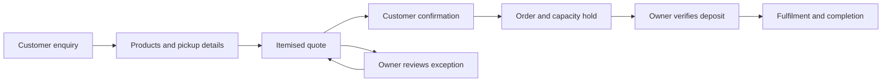
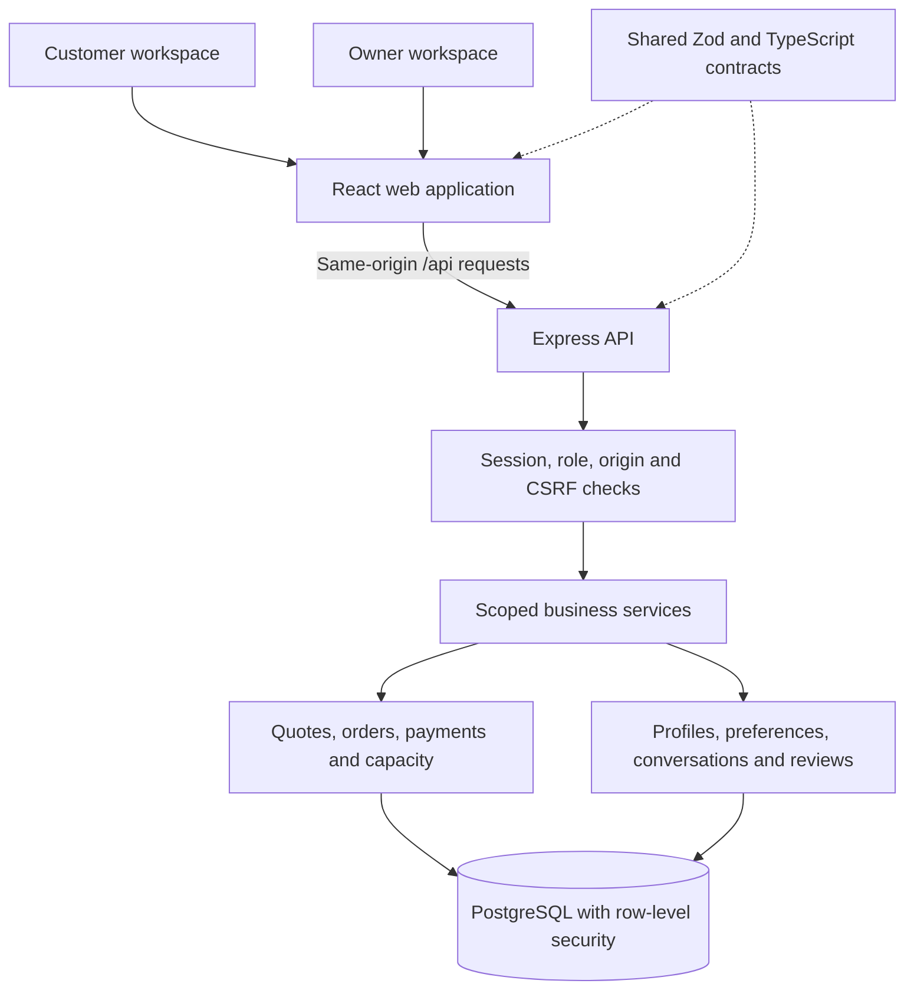

<div align="center">
  <h1>CustomerLane</h1>
  <h3>1 Customer, 1 Agent.</h3>
  <p><strong>Customer relationships. Clear orders. Confident operations.</strong></p>
  <p>Personal customer service and connected business operations for small businesses.</p>
  <p>
    <a href="#overview">Overview</a> &nbsp;|&nbsp;
    <a href="#1-customer-1-agent">1 Customer, 1 Agent</a> &nbsp;|&nbsp;
    <a href="#core-features">Core Features</a> &nbsp;|&nbsp;
    <a href="#customer-journey">Customer Journey</a> &nbsp;|&nbsp;
    <a href="#product-roadmap">Product Roadmap</a> &nbsp;|&nbsp;
    <a href="#tech-stack">Tech Stack</a> &nbsp;|&nbsp;
    <a href="#quick-start">Quick Start</a> &nbsp;|&nbsp;
    <a href="#documentation">Documentation</a>
  </p>
</div>

---

## Overview

CustomerLane brings customer conversations, preferences, orders and owner decisions into one business workspace. Its central idea is **1 Customer, 1 Agent**: a lasting customer relationship with relevant history, personal attention and clear next steps.

Small businesses often manage enquiries in one place, orders in another, and payments or production plans somewhere else. CustomerLane connects these activities so customers can review clear proposals and owners can see what needs attention.

The initial focus is Malaysian home bakeries, where repeat customers, pickup schedules, deposits and limited production capacity are part of everyday business.

| Business challenge | CustomerLane's approach |
| --- | --- |
| Customers repeat the same details | Keep conversations, order history and permitted preferences connected |
| Order details get lost in messages | Turn product, quantity, pickup date and time into a clear quote and order |
| Bookings exceed production capacity | Check availability and hold capacity after customer confirmation |
| Deposits and balances are difficult to track | Show verified payments, outstanding balances and the next action |
| Exceptions interrupt routine work | Bring discounts, custom requests and complaints into owner review |
| Owners need a clearer operating picture | Connect orders, customer activity, payments and pending decisions |

## 1 Customer, 1 Agent

**One customer. One continuing relationship.**

A customer may start with a product enquiry, return for another order and later need after-sales support. CustomerLane keeps those interactions connected through the same customer context.

The agent experience is designed to remember only permitted information, use current business facts and ask for missing details. Customers remain in control of their preferences and purchases. Owners retain authority over business commitments and financial decisions.

| Principle | What it means for the business |
| --- | --- |
| **Continuity** | Relevant conversations and order history stay with the customer across visits |
| **Personal service** | Consented preferences can support repeat-order suggestions and relevant recommendations |
| **Private customer context** | Each customer sees their own records and order details |
| **Clear commitments** | Every purchase requires acceptance of an exact quote |
| **Human support** | The owner can take over a conversation, resolve an issue and resume the workflow |
| **Visible oversight** | The planned agent dashboard gives the owner one card for each customer-agent relationship |

Customer records, saved conversations and owner handoff are available today. AI conversations, agent cards and proactive engagement are part of the product roadmap.

## Who CustomerLane Serves

| Customer | Business value |
| --- | --- |
| **Home bakery owners** | Coordinate enquiries, deposits, pickup dates and daily production commitments |
| **Small business owners** | Bring customer service and order administration into one workspace |
| **Student entrepreneurs** | Keep customer and order details organised around study and fulfilment |
| **Returning customers** | Access familiar order history and place a new order with clear terms |
| **First-time customers** | Understand products, prices, pickup details and how to confirm an order |

## Core Features

The following capabilities are available in the current product experience.

| Feature | What it provides |
| --- | --- |
| **Customer profiles and preferences** | Saved customer information, language choices and optional preference management |
| **Saved conversations** | A continuing record of customer and owner interactions |
| **Catalogue and pickup options** | Published products, prices, policies and available pickup arrangements |
| **Itemised quotes** | Clear quantities, total price, required deposit and quote validity |
| **Confirmed orders** | Explicit customer acceptance followed by a time-limited capacity hold |
| **Order history and status** | Order details, pickup information, verified payment amounts and remaining balance |
| **Owner review queue** | Controlled handling of discounts, custom requests, cancellations and complaints |
| **Human takeover** | Direct owner replies and explicit resume controls |
| **Payment verification** | Owner-reviewed payment records and deposit confirmation |
| **Production capacity** | Product/date capacity management with held, committed and remaining quantities |
| **Business overview** | Order, payment and review figures calculated from saved business records |
| **English and Bahasa Melayu** | Core customer actions and preference controls in both languages |

### Customer Workspace

Customers browse products, choose quantities and pickup details, and review an itemised quote before placing an order. They can revisit their order history, check outstanding balances, manage optional preferences and ask for the owner.

The experience keeps the next step clear: review the quote, confirm the order, check the deposit deadline or wait for an owner decision.

### Owner Workspace

Owners manage orders, review payments, maintain catalogue information and set production capacity. Pending exceptions and customer conversations are connected to the relevant business records.

The owner can respond directly when a customer needs help, review a proposed exception and retain control over fulfilment and financial decisions.

## Customer Journey



1. **Discover:** The customer reviews products and pickup information.
2. **Prepare:** Product, quantity, date and time slot form a clear order request.
3. **Review:** The customer receives an exact quote with total and deposit amounts.
4. **Confirm:** Customer acceptance records the order and holds available capacity.
5. **Verify:** The owner verifies the deposit before a valid hold becomes committed.
6. **Fulfil:** The owner manages preparation, pickup and completion with payment status visible.
7. **Return:** The customer's saved history supports the next visit; planned AI assistance will help propose a fresh repeat order.

An exception moves to owner review. A revised commercial offer requires customer acceptance, and an expired or changed quote must be refreshed before confirmation.

## Product Preview

### Customer Experience


### Owner Experience


## Product Roadmap

The following capabilities are planned additions to the customer and owner experience.

### Customer-Agent Dashboard

**1 box = 1 agent = 1 customer.**

The owner will see active and inactive customer-agent relationships in one dashboard. Each card will show the latest interaction, current task, processing state and any reason that human review is needed.

Opening a card will connect the owner to that customer's interaction history, orders and review cases. Several conversations will remain part of the same customer relationship. Takeover and resume controls will keep human involvement clear.

### AI Conversations for Customers and Owners

Customers will be able to ask product, order and support questions in English, Bahasa Melayu and common mixed-language phrasing. The assistant will clarify complex or incomplete requests and ground answers in current business information.

A separate owner assistant will answer business questions about sales, unpaid invoices, stock, forecasts and pending reviews. Financial decisions, price publication and customer commitments will remain subject to the appropriate explicit approval.

### Sales, Invoices and Stock Management

Planned invoice and receipt downloads will connect to existing order and verified payment records. Sales views will distinguish booked order value, completed sales, verified cash collected and outstanding balances.

Finished-goods stock management will track batches, sellable quantities, allocation, expiry, waste and adjustments. Physical stock and future production capacity will remain separately visible.

### Stock Prediction and Sales Forecasting

Demand and sales forecasts will help owners plan production and identify possible excess stock or shortages. Suggested quantities will consider usable stock, shelf life, known orders and remaining capacity.

Forecasts will show their reporting horizon, available history and uncertainty. Limited history will produce a clear insufficient-data state or a disclosed baseline rather than an unsupported prediction.

### Controlled Dynamic Pricing

Stock levels, expiry and demand signals will support price suggestions within owner-defined limits. The owner will review and publish changes before they become available to customers.

Confirmed orders will retain their agreed prices. Customers with an outdated quote will receive a refreshed proposal for acceptance.

### Customer Engagement and After-Sales Service

Planned engagement tools will support:

- **Fresh-batch announcements:** Share a recorded, currently available batch, such as freshly made Orange Cake.
- **Personalised recommendations:** Suggest relevant products using the customer's current request or explicitly permitted history.
- **Personalised promotions:** Present approved offers with clear eligibility and validity.
- **After-sales support:** Offer permitted check-ins and connect complaints or service questions to the owner.

Marketing will respect consent, quiet hours, contact limits and opt-out. A recommendation or promotion will return the customer to the ordinary quote and confirmation journey.

### Content Creation and Visual AI

Owners will be able to prepare multilingual product and marketing drafts for review.

| Content type | Planned use |
| --- | --- |
| **SEO product descriptions** | Product titles, descriptions and search-friendly summaries grounded in approved facts |
| **Marketing copy** | Campaign messages and product announcements with accurate offer terms |
| **Personalised emails** | Relevant customer communication within permitted preferences and marketing choices |
| **Social media content** | Reviewed posts and promotional copy ready for the selected audience |
| **PR content** | Business announcements and brand stories |
| **Generated visuals** | Marketing illustrations with clear origin, rights review and owner approval |

English and Bahasa Melayu will be the initial languages; additional languages will require review. Generated artwork will be identified as illustration where appropriate. Publication or delivery will require approval of the exact content and assets.

### Fraud and Transaction-Risk Review

Transaction-risk tools will highlight suspicious patterns such as duplicate payment references, unusual attempts or inconsistent submitted evidence. Private review cases will explain why attention is needed and allow the owner to clear a benign issue.

A risk flag will support investigation. Payment verification, receipts and financial decisions will continue to depend on verified business records and owner authority.

### Responsible Customer Relationships

The expanded agent experience will include safeguards for limited-data bias, privacy and AI transparency. Customers will be able to decline optional personalisation and stop promotions while continuing to order.

Recommendations and pricing will avoid sensitive-trait targeting and covert cross-platform tracking. Marketing will use truthful availability and offer terms, with clear human support and no fabricated urgency or pressure to keep shopping.

### Follow-Ups and Daily Business Summaries

Planned reminders will follow up on eligible unpaid orders, with checks for payment, expiry, customer permission and owner takeover. Daily summaries will bring together orders, verified payments, capacity, pending reviews and failed actions.

Additional communication channels will extend this experience when supported, with clear delivery status and the same customer permissions.

## Tech Stack

The current local application uses a TypeScript workspace with a React frontend, an Express API and PostgreSQL persistence. Versions below reflect the repository manifests; install from the lockfile to keep the workspace consistent.

| Layer | Technologies | Purpose |
| --- | --- | --- |
| **Runtime and workspace** | Node.js 24, pnpm 11.2.2, TypeScript 5.9 | Shared types, workspace packages and development scripts |
| **Web application** | React 19, Vite 8, React Router 7 | Customer and owner screens, navigation and development server |
| **UI and styling** | Tailwind CSS 4, Radix Slot, Lucide React | Reusable controls, styling and icons |
| **Forms and data** | React Hook Form 7, Zod 4, TanStack Query 5 | Form validation, API contracts and server-state management |
| **API** | Express 5, Zod 4, dotenv | HTTP routes, validated inputs and server configuration |
| **Database** | PostgreSQL 17, node-postgres (`pg`), SQL migrations | Persistent records, transactions and row-level security |
| **Schema tooling** | Drizzle ORM and Drizzle Kit | Database schema tooling; current business operations use parameterised SQL through `pg` |
| **Assistant foundation** | Shared typed contracts and a scripted-assistant package | Supported intent boundaries; the conversational response implementation is planned |
| **Build and quality** | Vite, esbuild, ESLint, Prettier, TypeScript, repository gate scripts | Web/API builds, static checks and integration verification |

The current order workflow uses forms and deterministic business services. The interface discloses **"Demo assistant — scripted responses"**; live AI and general language understanding are planned capabilities. Local setup requires no model API key or AI credits.

Forecasting, visual generation and fraud-analysis libraries are extension candidates, rather than installed features. The [technical requirements](TRD.md#15-github--hugging-face-candidate-register) list GitHub and Hugging Face options with licence, runtime and integration considerations.

## Architecture



The browser presents proposals and collects explicit decisions. The API establishes the trusted account scope and validates requests. Business services calculate money, reserve capacity and enforce valid state changes inside database transactions.

**1 Customer, 1 Agent** is a relationship boundary: conversations and orders belong to a persistent customer context. Several conversations must not create independent agents with conflicting customer memory. The future agent layer will use the same scoped services and approval rules.

| Business boundary | Implementation approach |
| --- | --- |
| **Customer privacy** | Server-derived business/customer scope and PostgreSQL row-level security |
| **Owner authority** | Owner-only operations for review decisions, payment verification, catalogue publication and capacity management |
| **Money** | Integer amounts in sen, displayed in MYR; totals and balances calculated by business services |
| **Availability** | Transactional production-capacity holds and commitments; physical stock is a planned separate ledger |
| **Order confirmation** | Exact quote acceptance with a confirmation challenge; changed or expired quotes require review again |
| **Safe retries** | Idempotency keys for supported business mutations to avoid duplicate effects |
| **Traceability** | Persisted business records and audit events |
| **Time** | Business timestamps displayed in `Asia/Kuala_Lumpur`; evaluation data uses a persisted business clock |

## Quick Start

### Requirements

- **Windows x64 with PowerShell** for the included PostgreSQL setup and database-management scripts.
- **Node.js `>=24.14.0 <25`** and **pnpm `11.2.2`**, matching `package.json`.
- **Git** and internet access for the initial clone, packages and database download.
- Free local ports **5173** (web), **3001** (API) and **54329** (PostgreSQL).

The database installer downloads an approximately 382 MB archive and extracts its runtime inside `.local/`. Allow additional space for extracted binaries, dependencies and database records. Docker and a separate PostgreSQL installation are not required for this Windows setup. A macOS/Linux bootstrap is not currently supplied.

If pnpm is not installed, install the pinned version after installing Node.js:

```powershell
npm install --global pnpm@11.2.2
node --version
pnpm --version
```

### Install and Launch

Run these commands in PowerShell:

```powershell
git clone https://github.com/TEE123754/SME.git
cd SME
pnpm install --frozen-lockfile
pnpm db:setup
pnpm db:migrate
pnpm db:seed
pnpm dev
```

If you already have this checkout, open PowerShell in its root directory and begin with `pnpm install --frozen-lockfile`.

| Step | What it does |
| --- | --- |
| `pnpm install --frozen-lockfile` | Installs the exact workspace dependency resolution |
| `pnpm db:setup` | Downloads the PostgreSQL runtime, initialises and starts the local database, and generates `.env` if absent |
| `pnpm db:migrate` | Applies pending SQL migrations and configures separate restricted runtime/worker database credentials |
| `pnpm db:seed` | Adds a synthetic bakery, an owner, ten customers and order history; an already-applied seed preserves existing edits |
| `pnpm dev` | Starts the local database if needed, then launches the API and web development servers |

Open **[http://127.0.0.1:5173](http://127.0.0.1:5173)**. The API health endpoint is **[http://127.0.0.1:3001/api/v1/health](http://127.0.0.1:3001/api/v1/health)**.

Use **`127.0.0.1` consistently** when opening the application, because write requests check the exact configured origin. The frontend forwards `/api` requests to the API through Vite's development proxy.

### Try the Customer and Owner Workflows

1. Open **Sign in** and select a synthetic customer. No password is required for the local account selector.
2. Open the customer workspace for **Aina's Home Bakery**. Choose products, quantities, pickup date and slot using the order form.
3. Choose a date that meets the published lead time relative to the displayed business time. Review the quote, price and deposit before confirming.
4. Open the saved order to inspect its capacity hold, deposit deadline and balance.
5. Use **Switch account** to select the synthetic owner. Open the owner's orders and verify a synthetic deposit with the expected amount and a unique payment reference.
6. Check the updated order, capacity and dashboard. Review exceptions or take over the related customer conversation when needed.
7. Return to the customer account to view the updated history and manage optional preferences.

These are local evaluation accounts and payment records. Payment verification records an owner decision; it does not charge a card, contact a bank or prove an external transfer. Customer accounts cannot verify payments or approve business exceptions.

### Stop and Restart

Press **Ctrl+C** in the development terminal to stop the web/API processes. PostgreSQL continues running until you stop it separately:

```powershell
pnpm db:stop
```

For a later session, run `pnpm dev` from the same checkout. Saved records remain in `.local/postgres/data`. Run `pnpm db:migrate` when an updated checkout introduces migrations; migrations require the database to be running, which can be started with `pnpm db:start`. The seed command is not a reset command.

## Configuration

The checked-in [`.env.example`](.env.example) documents the local configuration. `pnpm db:setup` creates the ignored `.env` with generated bootstrap credentials; `pnpm db:migrate` updates it with separate database-role credentials. Do not copy the placeholder template over a generated `.env`.

| Variable | Default / local setting | Role |
| --- | --- | --- |
| `APP_ENV` | `local-demo` | Supported local operating mode |
| `API_HOST` | `127.0.0.1` | Loopback API binding |
| `API_PORT` | `3001` | API listener and Vite proxy target |
| `WEB_PORT` | `5173` | Web development port |
| `AUTH_ADAPTER` | `demo` | Synthetic account selector |
| `ASSISTANT_MODE` | `scripted` | Declared assistant mode; live model integration is planned |
| `ALLOWED_ORIGINS` | `http://127.0.0.1:5173` | Exact permitted write-request origin; comma-separated loopback HTTP origins are supported |
| `DATABASE_URL` | Generated for `cb_runtime` | Restricted API database connection |
| `MIGRATION_DATABASE_URL` | Generated for `customerbuddy` | Administrative migration connection |
| `WORKER_DATABASE_URL` | Generated for `cb_worker` | Separate role reserved for job processing |
| `LOCAL_DOCUMENT_PATH` | `.local/documents` | Local document directory; must remain beneath `.local` |

Restart `pnpm dev` after changing `.env`. If you change `WEB_PORT`, update `ALLOWED_ORIGINS` and open the matching URL. Keep `API_PORT` consistent with the API and proxy. PostgreSQL port **54329** is currently fixed in the local scripts; changing database URLs alone does not move the bundled database.

Database credentials stay on the server. Never place credentials in `VITE_*` variables, screenshots, public documents or browser code. `.env`, `.local/`, dependencies and generated build outputs are ignored by Git.

## Commands

Run commands from the repository root.

| Command | Purpose |
| --- | --- |
| `pnpm dev` | Start the local web/API development environment |
| `pnpm db:setup` | Initialise the bundled Windows PostgreSQL runtime and local configuration |
| `pnpm db:start` | Start the local database |
| `pnpm db:stop` | Stop the local database |
| `pnpm db:status` | Check database process status |
| `pnpm db:migrate` | Apply pending migrations and configure database roles |
| `pnpm db:seed` | Apply the initial synthetic dataset once |
| `pnpm typecheck` | Check TypeScript types without emitting files |
| `pnpm lint` | Run ESLint with zero warnings allowed |
| `pnpm format` | Rewrite configured source/configuration files with Prettier |
| `pnpm build` | Compile the API and build the web application |
| `pnpm gate:phase1` | Foundation quality/build/startup checks |
| `pnpm gate:phase2` | Persistence and customer-scope verification gate |
| `pnpm gate:phase3` | Commerce and business-invariant verification gate |
| `pnpm gate:phase4` | Web/API quality, build and integration verification gate |

The API build is written to `apps/api/dist/server.mjs`; web assets are written to `apps/web/dist/`. `pnpm build` compiles artifacts and does not deploy or start a hosted application. There is currently no root `pnpm start` or `pnpm test` command.

Verification gates produce records in [`docs/evidence/`](docs/evidence/). Run the appropriate gate after completing the corresponding build checklist in the [implementation plan](IMPLEMENTATION_PLAN.md). Browser and accessibility reviews are recorded separately; a passing command does not establish that every browser check is complete.

## Repository Structure

```text
SME/
├── apps/
│   ├── web/                 React customer and owner application
│   ├── api/                 Express routes, sessions and service entry points
│   └── worker/              Job-processing contracts; runner is planned
├── packages/
│   ├── contracts/           Shared Zod schemas and TypeScript contracts
│   ├── domain/              Money, quote and business-time helpers
│   ├── db/                  SQL migrations, repositories and business services
│   └── demo-assistant/      Assistant disclosure and scripted-intent contracts
├── scripts/                 Database setup, development, build and verification
├── docs/                    Scenarios, screenshots and verification evidence
├── .env.example             Local configuration template
├── package.json             Root commands and supported tool versions
├── pnpm-lock.yaml           Locked dependency resolution
└── *.md                     Product, flow, design and technical specifications
```

Workspace packages currently use the `@customerbuddy/*` namespace. The public product name is CustomerLane.

## API Overview

The current API is rooted at `/api/v1`. This is a navigation guide to implemented endpoint families; exact request and response schemas live in [`packages/contracts/src/index.ts`](packages/contracts/src/index.ts), with routes in [`apps/api/src/app.ts`](apps/api/src/app.ts) and [`apps/api/src/commerce-routes.ts`](apps/api/src/commerce-routes.ts).

| Method | Endpoint | Purpose |
| --- | --- | --- |
| `GET` | `/health` | Local service and database readiness |
| `GET` | `/demo/accounts` | List synthetic sign-in accounts |
| `POST` / `DELETE` | `/demo/sessions` | Create or end a local session |
| `GET` / `PATCH` | `/me` | Current account and profile |
| `GET` / `PATCH` | `/me/preferences` | Read or update optional preferences |
| `GET` | `/catalogue`, `/knowledge`, `/pickup-options`, `/capacity` | Current product, policy, pickup and availability information |
| `GET` / `POST` | `/conversations` | Read or create scoped conversations |
| `GET` / `POST` | `/conversations/:id/messages` | Read or save scoped messages |
| `POST` | `/quotes` | Prepare an itemised quote |
| `POST` | `/quotes/:id/confirmation-challenge` | Create an exact-quote confirmation challenge |
| `POST` | `/orders/confirm` | Accept the quote and reserve available capacity |
| `GET` | `/orders`, `/orders/:id` | Customer-visible order history and details |
| `POST` | `/exceptions` | Request owner review |
| `GET` | `/owner/dashboard`, `/owner/orders`, `/owner/customers` | Owner operating views |
| `GET` | `/owner/approvals` | Pending and recorded review cases |
| `POST` | `/owner/approvals/:id/decision` | Record an owner review decision |
| `POST` | `/owner/payments/verify` | Record an owner-verified payment |
| `POST` | `/owner/orders/:id/status` | Apply an allowed fulfilment state change |
| `POST` | `/owner/conversations/:id/takeover` | Take over or release the customer conversation |
| `POST` | `/owner/knowledge/publish`, `/owner/capacity` | Publish business knowledge and manage production limits |

Except for health and the local sign-in bootstrap, requests require a session. Protected writes check the exact `Origin` and `X-CSRF-Token`; supported commerce mutations also require an `Idempotency-Key`. The browser client handles these headers and cookies. Owner/customer permissions are enforced server-side.

For a simple health check while the application is running:

```powershell
Invoke-RestMethod -Uri http://127.0.0.1:3001/api/v1/health
```

## Data and Security

PostgreSQL stores customer profiles, optional preferences and consents, conversations, versioned business knowledge, quotes, orders, payments, capacity records, approval cases and audit events. Data survives API or browser restarts.

- **Customer isolation:** customer queries execute with a trusted account scope and row-level security.
- **Separate database roles:** the API uses a restricted runtime role; migration and future worker credentials remain separate.
- **Session protection:** local sessions use an HttpOnly cookie, server-side session records, origin checks and CSRF protection for protected mutations.
- **Business authority:** payment verification and owner approvals are deterministic services. Customer messages do not grant permission to perform these actions.
- **Consent:** preference memory and marketing choices are explicit; optional personalisation can be declined.
- **Local storage:** database/runtime files live under `.local/`; planned document storage is inside `.local/documents`.

Hosted identity, live AI, external communication channels, production document storage and deployment require further implementation and verification. The current account selector and loopback configuration are intended for local evaluation. No production deployment URL is supplied.

## Troubleshooting

| Symptom | What to check |
| --- | --- |
| `pnpm` is not recognised | Install `pnpm@11.2.2`, reopen PowerShell and check `pnpm --version` |
| Unsupported Node version | Use Node.js `>=24.14.0 <25` as specified in `package.json` |
| Database is not initialised | Run `pnpm db:setup`, then `pnpm db:migrate` and `pnpm db:seed` |
| Database download fails | Check connectivity to the download host shown by `scripts/postgres.ps1`, then rerun `pnpm db:setup` |
| Database connection fails | Check `pnpm db:status`, start it with `pnpm db:start`, and inspect `.local/postgres/server.log` without sharing credentials |
| Invalid local configuration | Ensure setup generated `.env`, run `pnpm db:migrate`, and check field names reported by the API; template password placeholders are invalid |
| Port already in use | Stop the conflicting process, or update the supported web/API ports and matching origin in `.env` |
| Saves fail with an origin error | Open the configured `http://127.0.0.1:5173` origin rather than a different hostname or port |
| Session expired or CSRF denied | Sign out and sign in again to refresh the local session |
| Customer cannot open owner actions | Switch to the synthetic owner account; the server enforces the role |
| Pickup date is rejected | Compare it with displayed business time and the published lead-time policy |
| Quote expired or policy changed | Prepare a fresh quote and review it before confirmation |
| Capacity unavailable | Choose another pickup date or quantity, or have the owner review the production limit |
| An order cannot be completed | Check verified payment balance, pending reviews and allowed fulfilment transitions |
| Rerunning seed does not clear records | Seed is intentionally applied once and preserves subsequent customer/owner edits |
| Chat does not answer a complex request | Use the current form and supported workflow; live AI conversation is on the roadmap |

## Documentation

| Document | What it covers |
| --- | --- |
| [Product Requirements](PRD.md) | Product scope, customer value, feature requirements and acceptance criteria |
| [Technical Requirements](TRD.md) | Architecture, service boundaries, integrations and candidate libraries/models |
| [App Flow](APP_FLOW.md) | Customer and owner journeys, decisions and exception handling |
| [Design Brief](DESIGN_BRIEF.md) | Screens, component behaviour, visual direction and accessibility |
| [Backend Schema](BACKEND_SCHEMA.md) | Data model, database constraints and planned extensions |
| [Implementation Plan](IMPLEMENTATION_PLAN.md) | Build sequence, verification gates and saved progress |
| [Customer and Owner Scenarios](docs/PHASE4_SCENARIOS.md) | End-to-end workflow scenarios and expected outcomes |
| [Verification Evidence](docs/evidence/) | Recorded checks and product screenshots |

---

<div align="center">
  <strong>1 Customer, 1 Agent.</strong><br/>
  <em>Customer relationships. Clear orders. Confident operations.</em>
</div>
