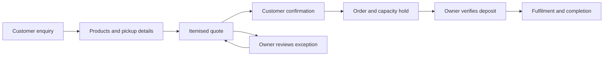
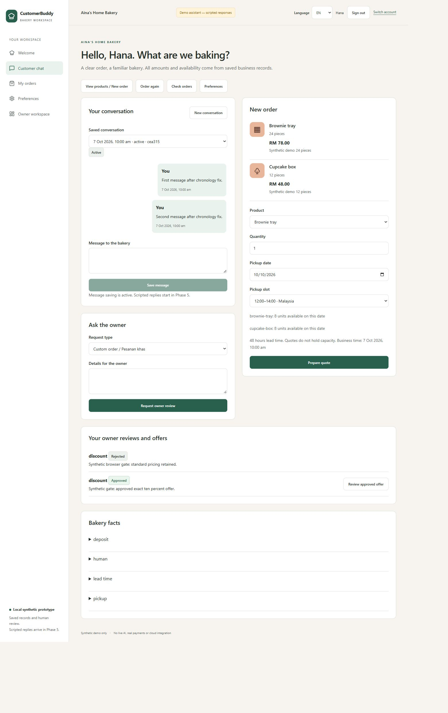
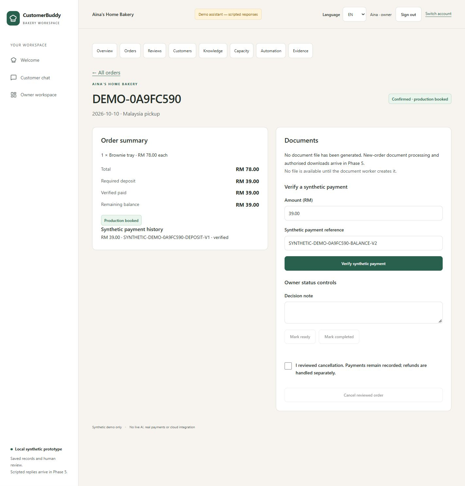

  <h1>CustomerLane</h1>
  <h3>1 Customer, 1 Agent.</h3>
  
<strong>Customer relationships. Clear orders. Confident operations.</strong>

  
Personal customer service and connected business operations for small businesses.

  

    <a href="#overview">Overview</a> &nbsp;|&nbsp;
    <a href="#1-customer-1-agent">1 Customer, 1 Agent</a> &nbsp;|&nbsp;
    <a href="#core-features">Core Features</a> &nbsp;|&nbsp;
    <a href="#customer-journey">Customer Journey</a> &nbsp;|&nbsp;
    <a href="#product-roadmap">Product Roadmap</a>
  

---

## Overview

CustomerLane brings customer conversations, preferences, orders and owner decisions into one business workspace. Its central idea is **1 Customer, 1 Agent**: a lasting customer relationship with relevant history, personal attention and clear next steps.

Small businesses often manage enquiries in one place, orders in another, and payments or production plans somewhere else. CustomerLane connects these activities so customers can review clear proposals and owners can see what needs attention.

The initial focus is Malaysian home bakeries, where repeat customers, pickup schedules, deposits and limited production capacity are part of everyday business.

| Business challenge | CustomerLane's approach |
| --- | --- |
| Customers repeat the same details | Keep conversations, order history and permitted preferences connected |
| Order details get lost in messages | Turn product, quantity, pickup date and time into a clear quote and order |
| Bookings exceed production capacity | Check availability and hold capacity after customer confirmation |
| Deposits and balances are difficult to track | Show verified payments, outstanding balances and the next action |
| Exceptions interrupt routine work | Bring discounts, custom requests and complaints into owner review |
| Owners need a clearer operating picture | Connect orders, customer activity, payments and pending decisions |

## 1 Customer, 1 Agent

**One customer. One continuing relationship.**

A customer may start with a product enquiry, return for another order and later need after-sales support. CustomerLane keeps those interactions connected through the same customer context.

The agent experience is designed to remember only permitted information, use current business facts and ask for missing details. Customers remain in control of their preferences and purchases. Owners retain authority over business commitments and financial decisions.

| Principle | What it means for the business |
| --- | --- |
| **Continuity** | Relevant conversations and order history stay with the customer across visits |
| **Personal service** | Consented preferences can support repeat-order suggestions and relevant recommendations |
| **Private customer context** | Each customer sees their own records and order details |
| **Clear commitments** | Every purchase requires acceptance of an exact quote |
| **Human support** | The owner can take over a conversation, resolve an issue and resume the workflow |
| **Visible oversight** | The planned agent dashboard gives the owner one card for each customer-agent relationship |

Customer records, saved conversations and owner handoff are available today. AI conversations, agent cards and proactive engagement are part of the product roadmap.

## Who CustomerLane Serves

| Customer | Business value |
| --- | --- |
| **Home bakery owners** | Coordinate enquiries, deposits, pickup dates and daily production commitments |
| **Small business owners** | Bring customer service and order administration into one workspace |
| **Student entrepreneurs** | Keep customer and order details organised around study and fulfilment |
| **Returning customers** | Access familiar order history and place a new order with clear terms |
| **First-time customers** | Understand products, prices, pickup details and how to confirm an order |

## Core Features

The following capabilities are available in the current product experience.

| Feature | What it provides |
| --- | --- |
| **Customer profiles and preferences** | Saved customer information, language choices and optional preference management |
| **Saved conversations** | A continuing record of customer and owner interactions |
| **Catalogue and pickup options** | Published products, prices, policies and available pickup arrangements |
| **Itemised quotes** | Clear quantities, total price, required deposit and quote validity |
| **Confirmed orders** | Explicit customer acceptance followed by a time-limited capacity hold |
| **Order history and status** | Order details, pickup information, verified payment amounts and remaining balance |
| **Owner review queue** | Controlled handling of discounts, custom requests, cancellations and complaints |
| **Human takeover** | Direct owner replies and explicit resume controls |
| **Payment verification** | Owner-reviewed payment records and deposit confirmation |
| **Production capacity** | Product/date capacity management with held, committed and remaining quantities |
| **Business overview** | Order, payment and review figures calculated from saved business records |
| **English and Bahasa Melayu** | Core customer actions and preference controls in both languages |

### Customer Workspace

Customers browse products, choose quantities and pickup details, and review an itemised quote before placing an order. They can revisit their order history, check outstanding balances, manage optional preferences and ask for the owner.

The experience keeps the next step clear: review the quote, confirm the order, check the deposit deadline or wait for an owner decision.

### Owner Workspace

Owners manage orders, review payments, maintain catalogue information and set production capacity. Pending exceptions and customer conversations are connected to the relevant business records.

The owner can respond directly when a customer needs help, review a proposed exception and retain control over fulfilment and financial decisions.

## Customer Journey

1. **Discover:** The customer reviews products and pickup information.
2. **Prepare:** Product, quantity, date and time slot form a clear order request.
3. **Review:** The customer receives an exact quote with total and deposit amounts.
4. **Confirm:** Customer acceptance records the order and holds available capacity.
5. **Verify:** The owner verifies the deposit before a valid hold becomes committed.
6. **Fulfil:** The owner manages preparation, pickup and completion with payment status visible.
7. **Return:** The customer's saved history supports the next visit; planned AI assistance will help propose a fresh repeat order.

An exception moves to owner review. A revised commercial offer requires customer acceptance, and an expired or changed quote must be refreshed before confirmation.

## Product Preview

### Customer Experience

### Owner Experience

## Product Roadmap

The following capabilities are planned additions to the customer and owner experience.

### Customer-Agent Dashboard

**1 box = 1 agent = 1 customer.**

The owner will see active and inactive customer-agent relationships in one dashboard. Each card will show the latest interaction, current task, processing state and any reason that human review is needed.

Opening a card will connect the owner to that customer's interaction history, orders and review cases. Several conversations will remain part of the same customer relationship. Takeover and resume controls will keep human involvement clear.

### AI Conversations for Customers and Owners

Customers will be able to ask product, order and support questions in English, Bahasa Melayu and common mixed-language phrasing. The assistant will clarify complex or incomplete requests and ground answers in current business information.

A separate owner assistant will answer business questions about sales, unpaid invoices, stock, forecasts and pending reviews. Financial decisions, price publication and customer commitments will remain subject to the appropriate explicit approval.

### Sales, Invoices and Stock Management

Planned invoice and receipt downloads will connect to existing order and verified payment records. Sales views will distinguish booked order value, completed sales, verified cash collected and outstanding balances.

Finished-goods stock management will track batches, sellable quantities, allocation, expiry, waste and adjustments. Physical stock and future production capacity will remain separately visible.

### Stock Prediction and Sales Forecasting

Demand and sales forecasts will help owners plan production and identify possible excess stock or shortages. Suggested quantities will consider usable stock, shelf life, known orders and remaining capacity.

Forecasts will show their reporting horizon, available history and uncertainty. Limited history will produce a clear insufficient-data state or a disclosed baseline rather than an unsupported prediction.

### Controlled Dynamic Pricing

Stock levels, expiry and demand signals will support price suggestions within owner-defined limits. The owner will review and publish changes before they become available to customers.

Confirmed orders will retain their agreed prices. Customers with an outdated quote will receive a refreshed proposal for acceptance.

### Customer Engagement and After-Sales Service

Planned engagement tools will support:

- **Fresh-batch announcements:** Share a recorded, currently available batch, such as freshly made Orange Cake.
- **Personalised recommendations:** Suggest relevant products using the customer's current request or explicitly permitted history.
- **Personalised promotions:** Present approved offers with clear eligibility and validity.
- **After-sales support:** Offer permitted check-ins and connect complaints or service questions to the owner.

Marketing will respect consent, quiet hours, contact limits and opt-out. A recommendation or promotion will return the customer to the ordinary quote and confirmation journey.

### Content Creation and Visual AI

Owners will be able to prepare multilingual product and marketing drafts for review.

| Content type | Planned use |
| --- | --- |
| **SEO product descriptions** | Product titles, descriptions and search-friendly summaries grounded in approved facts |
| **Marketing copy** | Campaign messages and product announcements with accurate offer terms |
| **Personalised emails** | Relevant customer communication within permitted preferences and marketing choices |
| **Social media content** | Reviewed posts and promotional copy ready for the selected audience |
| **PR content** | Business announcements and brand stories |
| **Generated visuals** | Marketing illustrations with clear origin, rights review and owner approval |

English and Bahasa Melayu will be the initial languages; additional languages will require review. Generated artwork will be identified as illustration where appropriate. Publication or delivery will require approval of the exact content and assets.

### Fraud and Transaction-Risk Review

Transaction-risk tools will highlight suspicious patterns such as duplicate payment references, unusual attempts or inconsistent submitted evidence. Private review cases will explain why attention is needed and allow the owner to clear a benign issue.

A risk flag will support investigation. Payment verification, receipts and financial decisions will continue to depend on verified business records and owner authority.

### Responsible Customer Relationships

The expanded agent experience will include safeguards for limited-data bias, privacy and AI transparency. Customers will be able to decline optional personalisation and stop promotions while continuing to order.

Recommendations and pricing will avoid sensitive-trait targeting and covert cross-platform tracking. Marketing will use truthful availability and offer terms, with clear human support and no fabricated urgency or pressure to keep shopping.

### Follow-Ups and Daily Business Summaries

Planned reminders will follow up on eligible unpaid orders, with checks for payment, expiry, customer permission and owner takeover. Daily summaries will bring together orders, verified payments, capacity, pending reviews and failed actions.

Additional communication channels will extend this experience when supported, with clear delivery status and the same customer permissions.

---

  <strong>1 Customer, 1 Agent.</strong> 
  <em>Customer relationships. Clear orders. Confident operations.</em>

