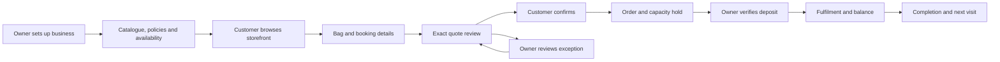
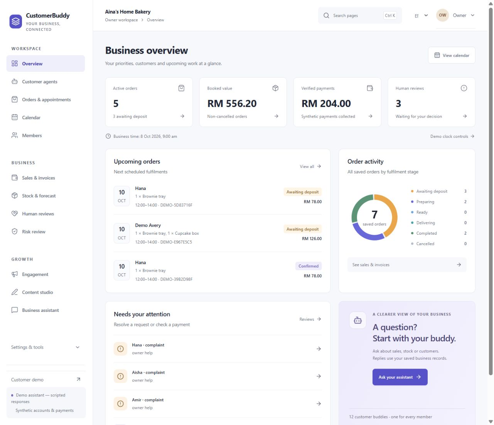
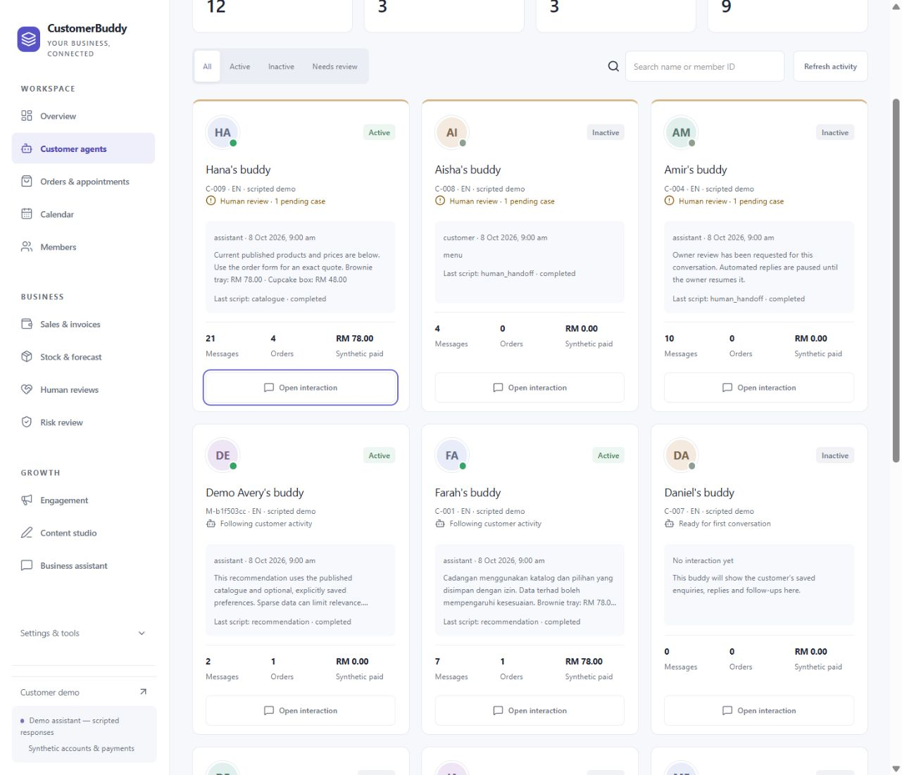
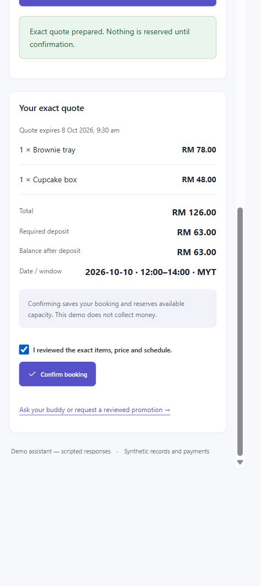

<div align="center">
  <h1>BizBuddy</h1>
  <h3>The connected customer and operations workspace for SMEs.</h3>
  <p><strong>1 Customer, 1 Agent. Every relationship connected to the next business action.</strong></p>
  <p>Bring your storefront, customer conversations, orders and daily decisions into one place.</p>
  <p>
    <a href="#why-bizbuddy-for-your-sme">Why BizBuddy</a> &nbsp;|&nbsp;
    <a href="#what-you-can-do">Features</a> &nbsp;|&nbsp;
    <a href="#how-to-run-locally">Run Locally</a> &nbsp;|&nbsp;
    <a href="#app-flow">App Flow</a> &nbsp;|&nbsp;
    <a href="#product-preview">Preview</a> &nbsp;|&nbsp;
    <a href="#technology-and-architecture">Technology</a>
  </p>
</div>

---

## Why BizBuddy for Your SME

**Your next order should move your business forward, without adding another spreadsheet or another conversation to chase.**

BizBuddy helps **small and medium-sized enterprises (SMEs)** connect the customer relationship to the work behind it. Publish your products or services, let customers browse and book, review exact quotes, track deposits and balances, and see the decisions that need your attention in one workspace.

For an SME owner, personal service is a strength. BizBuddy keeps that personal touch connected to a reliable record: what the customer asked for, what they agreed to, what has been paid and what happens next.

The current experience supports small retail and service businesses, with a Malaysian home bakery as the first example. It is particularly suited to businesses with repeat customers, scheduled fulfilment and limited daily capacity.

| When your business needs… | BizBuddy helps you… |
| --- | --- |
| A clearer way to take orders | Offer a storefront, shopping bag and guided checkout |
| Customer service with continuity | Keep each customer's conversations, history and permitted preferences together |
| Fewer missing order details | Capture items, quantities, date and time in an itemised quote |
| Better control of bookings | Check capacity before accepting a confirmed commitment |
| Visibility into deposits and balances | Review payment records and see what remains outstanding |
| A manageable daily workload | See upcoming orders, stage counts and named priorities on the overview |
| Room to grow customer relationships | Manage optional membership, consent-aware updates and content drafts |

**Start with one business, one storefront and one complete order.** Follow [the local setup](#how-to-run-locally), explore the existing bakery, then create a workspace for your own business scenario.

## 1 Customer, 1 Agent

One customer should feel recognised across visits. BizBuddy keeps a persistent customer context that connects saved conversations, order history and consented preferences. The owner gets one customer-agent card per relationship, with a focused interaction view and direct takeover when human help is needed.

Customers review their purchases explicitly. Owners retain control over payments, exceptions and business commitments. Optional preference memory, reminder settings and marketing consent remain separate choices.

Current assistants use disclosed rules and response templates backed by saved business records. Live AI and general language understanding are future capabilities.

## What You Can Do

| Area | Available capabilities |
| --- | --- |
| **Business setup** | Guided onboarding, business facts, product/service catalogue, policies, capacity and storefront preview |
| **Customer shopping** | Public catalogue browsing, item details and illustrations, multi-item bag, date/time selection and exact quote review |
| **Orders & appointments** | Confirmed bookings, capacity holds, order history, balances, fulfilment status and owner review |
| **Customer relationships** | Agent cards, scoped transcripts, owner takeover/reply/resume, preferences and member directory |
| **Membership** | Optional customer club, configurable programme and membership discounts on eligible new quotes |
| **Daily operations** | Overview priorities, searchable orders, calendar bookings and internal tasks |
| **Sales & documents** | Recorded order/payment summaries and private PDF quotes, order summaries, invoices and receipts after processing |
| **Stock & planning** | Finished-goods stock movements, reservations, baseline forecasts and owner-reviewed price proposals |
| **Engagement** | Consent-filtered audience previews, reviewed campaigns and local customer inbox updates |
| **Content studio** | Editable multilingual copy templates and exportable SVG visual templates |
| **Automation** | Local document jobs, deposit reminders, operational digests and owner pause/retry controls |

Core customer workflows support English and Bahasa Melayu. Content templates also offer Chinese framing. Forecasts, content and assistant replies use rules or templates; figures, availability, permissions and order actions come from persisted services.

## How to Run Locally

### 1. Prepare your computer

The included database setup supports **Windows x64 with PowerShell**.

- Install **Node.js `>=24.14.0 <25`** and **Git**.
- Use **pnpm `11.2.2`**, as pinned in `package.json`.
- Keep ports **5173** (web), **3001** (API) and **54329** (PostgreSQL) available.
- Allow storage for dependencies, PostgreSQL binaries and local data. The initial database download is approximately 382 MB.
- Internet access is needed for initial package installation and the database download. Docker and a separate PostgreSQL installation are not required.

If pnpm is not installed, run:

```powershell
npm install --global pnpm@11.2.2
node --version
pnpm --version
```

### 2. Install and start

Run the following in PowerShell:

```powershell
git clone https://github.com/TEE123754/SME.git
cd SME
pnpm install --frozen-lockfile
pnpm db:setup
pnpm db:migrate
pnpm db:seed
pnpm dev
```

| Command | What happens |
| --- | --- |
| `pnpm install --frozen-lockfile` | Installs the locked workspace dependencies |
| `pnpm db:setup` | Downloads PostgreSQL, creates and starts the local database, and generates private `.env` credentials |
| `pnpm db:migrate` | Applies the schema and provisions restricted runtime/worker roles |
| `pnpm db:seed` | Adds the initial bakery, owner, customers and history; repeated seeding preserves existing edits |
| `pnpm dev` | Starts the database, web/API services and the local job scheduler |

Open **[BizBuddy locally](http://127.0.0.1:5173)**. Use `127.0.0.1` consistently because protected writes check the configured origin. The [API health endpoint](http://127.0.0.1:3001/api/v1/health) reports service readiness.

Already have this checkout? Run the install/setup steps from its root directory. Keep the generated `.env`; do not overwrite it with placeholder values from `.env.example`.

### 3. Choose your first experience

| Your goal | Where to begin |
| --- | --- |
| Set up a new SME workspace | Home → **Set up my business** |
| Explore the customer experience | [Aina's storefront](http://127.0.0.1:5173/b/ainas-home-bakery) → browse → add to bag → checkout |
| Explore owner operations | [Sign in](http://127.0.0.1:5173/sign-in?next=%2Fowner) → select the existing owner → Overview |
| Continue a saved setup | Home → **Continue owner setup**, or owner Overview → **Review setup** |

Local sign-in uses synthetic accounts without passwords. Payments are synthetic owner-verified records; the application does not charge cards or contact a bank. Each new business receives an isolated owner and shopper account. No cloud or model API key is required.

### 4. Stop, restart or update

Press **Ctrl+C** in the development terminal to stop the web, API and scheduler. Stop PostgreSQL separately if needed:

```powershell
pnpm db:stop
```

For a later session, run `pnpm dev` again. Records persist in `.local/postgres/data`; seeding is not a reset.

After pulling an update that adds dependencies or migrations, stop the development server and run:

```powershell
pnpm install --frozen-lockfile
pnpm db:start
pnpm db:migrate
pnpm dev
```

## App Flow

### New User: Get from First Visit to a Ready Business

1. **Open the home page** and choose **Set up my business**.
2. **Create the workspace:** enter a business name, unique storefront address, industry and fulfilment method. The local app creates the business and its owner/shopper accounts.
3. **Business & collection:** save your business information, publish its facts and add at least one available product or service with a price and illustration.
4. **Policies:** review lead time, deposit requirements and pickup/fulfilment terms. The initial defaults are a 48-hour lead time and 50% deposit; adjust them to your scenario.
5. **Availability:** set future date capacity for each available item, taking the displayed business time and lead time into account.
6. **Preview & finish:** check the saved readiness checklist and preview the customer storefront at `/b/<your-business-slug>`.
7. **Open the owner dashboard.** Use the new business's shopper account to try its first order, then return as owner to manage it.

Each setup form saves independently, so you can return through **Review setup**. A ready storefront is based on published facts, available catalogue items and eligible capacity; previewing it does not reserve stock or create an order.

### Owner: Run the Day with Clear Priorities

1. **Sign in as owner** and open **Overview** for saved metrics, upcoming orders, stage counts and priorities.
2. **Open Orders & appointments:** search or filter bookings, open an order and inspect its quote, deposit deadline, balance and status.
3. **Verify a payment record:** enter the received amount and a unique synthetic reference. A sufficient deposit commits a valid capacity hold; late or conflicting cases require review.
4. **Resolve Human reviews:** inspect the request and exact offer, then approve or reject. A changed commercial offer goes back to the customer for acceptance.
5. **Use Customer agents** to inspect a scoped conversation, take over, reply and explicitly resume the assistant when the issue is resolved.
6. **Manage fulfilment:** follow the permitted order stages and complete the order after the required balance is verified.
7. **Plan and reconcile:** use Calendar, Sales & invoices and Stock & forecast to inspect bookings, payment records, documents and stock movements.
8. **Build the next visit:** review member settings, consent-filtered engagement and content drafts before approving local updates.

Use **Settings & tools → Automation** to run due jobs, inspect failures and generate a digest. The local scheduler runs while the API is open; pending documents appear after processing. Owner decisions remain separate from customer assistant permissions.

### Customer: Browse, Book and Stay Informed

1. **Open a storefront** at `/b/<business-slug>`. Browse products or services, illustrations, prices and published business information without signing in.
2. **Build your bag:** choose items and quantities, then open **Checkout / book**.
3. **Sign in to that business's shopper account** when prompted. The saved browsing bag transfers to an empty account basket.
4. **Choose a date and time window** that meets the business's lead-time and capacity rules.
5. **Review the exact quote:** check every item, the total, deposit and booking details. Select the review checkbox, then **Confirm booking**. Changing the basket or schedule clears the old quote and requires another review.
6. **Open Your orders:** see the saved booking, capacity hold, payment deadline and outstanding balance. Payment status updates after owner verification.
7. **Track fulfilment and documents:** revisit the order and download available PDFs after processing. Use **Your buddy** or owner help for supported questions and exceptions.
8. **Choose how to stay connected:** manage preferences and consent, optionally join Members and read approved notices in My updates. Newsletter consent is independent of membership.

No order is created by browsing, asking a question or joining the club. An expired quote needs a fresh review; unavailable capacity requires another date, quantity or owner decision.



### Try One Complete Order

Use the existing bakery to follow the journey without configuring a new business:

1. Browse **Aina's Home Bakery**, add an available item and sign in as a customer.
2. Choose an eligible pickup date/window, review the quote and confirm it.
3. Note the order code and required deposit, then switch to the owner account.
4. Open that order and verify the synthetic deposit using a unique `SYNTHETIC-` reference.
5. Run due jobs from Automation and return to the customer order to inspect its updated status and available documents.

This walkthrough shows the central product promise: **a customer commitment and an owner action stay connected to the same reliable order record.**

## Product Preview

### Owner Overview



### Customer Relationships



### Customer Quote Review



The product and interface name is BizBuddy (adopted 9 October 2026). Internal package namespaces, database identifiers and existing route aliases retain `customerbuddy` for compatibility. Historical screenshots and reference packs retain their original branding. Tencent WorkBuddy is the separate rebuild platform.

## Technology and Architecture

| Layer | Technology |
| --- | --- |
| Runtime | Node.js 24, TypeScript and pnpm workspaces |
| Frontend | React, Vite, React Router and Tailwind CSS |
| Forms and server data | React Hook Form, Zod and TanStack Query |
| API | Express with validated, scoped business services |
| Persistence | PostgreSQL, SQL migrations, parameterised queries and row-level security |
| Jobs and documents | Bounded local scheduler, persisted jobs and private PDF storage |

The browser collects explicit choices. The API establishes customer/owner scope, validates requests and invokes transactional services for money, orders and capacity. Dashboard totals come from stored records.

| Directory | Responsibility |
| --- | --- |
| `apps/web` | Storefront, customer workspace and owner operations |
| `apps/api` | Sessions, commerce, shopping, assistance and local job processing |
| `apps/worker` | Shared background-job contracts |
| `packages` | Contracts, domain rules, database services and assistant foundations |
| `scripts` | Setup, migrations, startup, build and verification gates |
| `docs` | Runbooks, scenarios, screenshots and recorded verification |

## Data, Permissions and Release Scope

- Customer records are scoped on the server and in PostgreSQL; customers cannot approve owner actions or verify payments.
- Quotes bind confirmation to the reviewed proposal. Supported mutations use idempotency controls to protect against duplicate effects.
- Money uses integer sen; capacity holds, payments and fulfilment follow deterministic business rules.
- HttpOnly sessions, origin checks and CSRF protection guard authenticated browser operations.
- Generated credentials, database files and private documents stay in ignored `.env` and `.local/` paths.
- Optional preference memory, reminders, marketing and club membership use distinct controls.

The current release is a local evaluation application with synthetic identities, payments and inbox delivery. Production authentication, live payment integrations, external messaging and hosted deployment remain future work. Baseline forecasts and risk flags support owner review; they do not establish predictive accuracy or automate financial decisions.

## Useful Commands and Troubleshooting

| Command | Purpose |
| --- | --- |
| `pnpm dev` | Start the local application and scheduler |
| `pnpm db:status` | Check PostgreSQL status |
| `pnpm db:start` / `pnpm db:stop` | Control the database separately |
| `pnpm db:migrate` | Apply pending migrations |
| `pnpm build` | Build web and API artifacts; does not deploy |
| `pnpm typecheck` / `pnpm lint` | Run static checks |

Run the appropriate verification gate after completing its build checklist in [the implementation plan](IMPLEMENTATION_PLAN.md). Existing results are in [docs/evidence](docs/evidence/). The current browser review retains an explicitly deferred 200% zoom check.

| Problem | Next step |
| --- | --- |
| pnpm is not recognised | Install `pnpm@11.2.2`, reopen PowerShell and check its version |
| Unsupported Node version | Use `>=24.14.0 <25`, matching `package.json` |
| Database connection fails | Run `pnpm db:status` and `pnpm db:start`; first use also needs setup and migrations |
| A save fails with an origin error | Open `http://127.0.0.1:5173` rather than another hostname |
| Session expired | Sign out and sign in again |
| Storefront is not ready | Publish business facts, an available item and eligible future capacity |
| Pickup date or capacity is rejected | Check displayed business time, lead time and availability |
| Quote changed or expired | Prepare and explicitly review a fresh quote |
| Documents are still preparing | Check Automation and run due jobs; keep the existing order |
| Customer cannot perform owner actions | Sign in as the business owner |

## Documentation and Feedback

| Reference | Purpose |
| --- | --- |
| [Product requirements](PRD.md) | Scope, business value and acceptance criteria |
| [App flow](APP_FLOW.md) | Detailed journeys and exception handling |
| [Technical requirements](TRD.md) | Architecture and service boundaries |
| [Design brief](DESIGN_BRIEF.md) | Screen behaviour, visual design and accessibility |
| [Backend schema](BACKEND_SCHEMA.md) | Data model, constraints and permissions |
| [Implementation plan](IMPLEMENTATION_PLAN.md) | Progress, verification and active checkpoint |
| [Local runbook](docs/phase6/RUNBOOK.md) | Runtime recovery and operational walkthrough |
| [Expanded capabilities](docs/EXPANDED_DEMO.md) | Detailed feature contracts and limitations |

Report problems or suggest improvements through [GitHub Issues](https://github.com/TEE123754/SME/issues). Include the affected workflow, reproduction steps and expected behaviour, with private information removed from screenshots or logs.

**See how BizBuddy fits your SME:** run it locally, create your business workspace, and follow one order from first enquiry to fulfilment.
